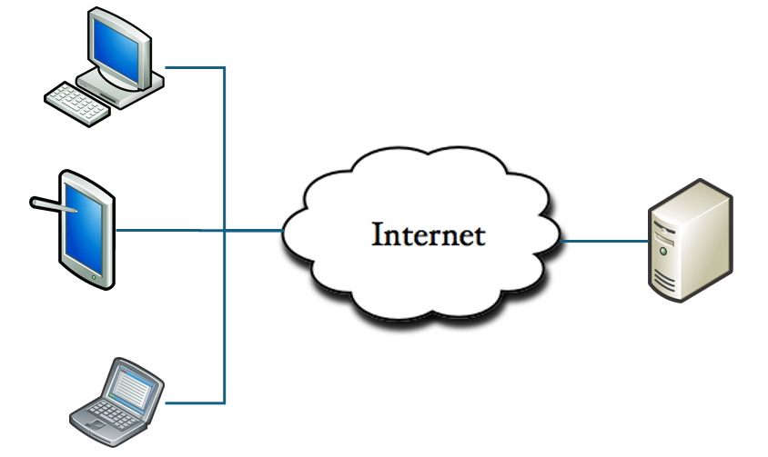

== 클라이언트-서버 아키텍처

* 리소스를 사용하는 클라이언트와 리소스가 존재하는 서버를 분리
* 클라이언트(Client)
** 서비스를 사용하는 사용자 또는 사용자의 단말기
** 일반적으로 데스크톱 컴퓨터나 노트북을 일컽으며, 네트워크를 통해 서버에 연결
* 서버(Server)
** 서비스를 제공하는 컴퓨터
** 다수의 클라이언트를 위해 존재하므로 일반적으로 큰 용량과 성능을 가짐

---

클라이언트-서버 아키텍처(Client-Server Architecture)는 리소스를 사용하는 클라이언트와 리소스가 존재하는 서버를 분리한 가장 단순한 분산 아키텍처 모델중의 하나입니다. 

이 모델은 서비스 요청자인 클라이언트와 서비스 자원의 제공자인 서버간에 작업을 분리하는 것이 목적으로, 분산 애플리케이션 구조이며 네트워크 아키텍처를 나타냅니다. 웹 애플리케이션도 확장된 클라이언트 서버 시스템으로 분류할 수 있지만 일반적으로 Client-Server System 이라고 하면 웹 애플리케이션이 나오기 이전의 사용자 PC에는 클라이언트 응용 프로그램이 설치되고, 서버에서는 데이터를 처리하는 시스렘을 말합니다.

클라이언트-서버 구조로 된 네트워크 프로그램을 작성하거나, 특정 시스템이 클라이언트-서버 구조로 만들어져 있다는 것은 클라이언트와 서버가 각자의 역할에 맞도록 구성되어 있다는 것을 의미합니다. 대표적으로 웹 애플리케이션을 들 수 있습니다. 웹 애플리케이션에서는 웹 서버(IIS, Apache 등)가 서버 역할을 하고, 웹 브라우저가 클라이언트 프로그램이 됩니다.

웹 애플리케이션이 등장하기 이전, Visual Basic이나 PowerBuilder 등의 4-GL 언어로 작성된 데이터베이스 응용 프로그램이 전형적인 클라이언트-서버 아키텍처로 구성되며, 파일 서버나 메일 서버 등이 클라이언트-서버 아키텍처로 구성됩니다.

== 클라이언트(Client)

`클라이언트` 는 서버의 서비스를 받아 사용하는 장치 또는 프로그램을 말하며. 때로는 서비스를 사용하는 사용자를 말하기도 합니다.

클라이언트 장치는 최종 사용자가 네트워크를 통해 서비스 또는 데이터에 접근하는데 사용하는 시스템으로 데스크톱, 노트북, 태블릿등을 말하기도 하며, 웹 애플리케이션이 등장한 이후에는 웹을 통해 서비스를 요청할 수 있게 하는 웹 브라우저를 사용할 수 있는 장치를 말하기도 합니다.

일반적으로 Client-Server System이라고 하면 웹 애플리케이션이 나오기 이전의, 클라이언트 응용 프로그램이 사용자 PC에 설치되고, 서버에서는 데이터를 처리하는 시스템을 말합니다.

== 서버(Server)

`서버` 네트워크를 통해 클라이언트에게 서비스를 제공하는 시스템을 말하며, 데이터를 포함하거나 네트워크의 다른 컴퓨터에서 액세스하는 기능을 제공하는 컴퓨터를 말합니다.

서버는 일반적으로 클라이언트의 요청에 대해 응답해주는 시스템으로, 간단하게 어떤 서비스 또는 데이터를 제공해주는 컴퓨터입니다. 다수의 클라이언트를 위해 존재하기 때문에 일반적으로 큰 용량과 성능을 가지고 있으나, 웹 애플리케이션이 발전하고 마이크로서비스가 등장하면서 작은 규모의 서비스로 분할되어 존재할 수도 있습니다.
