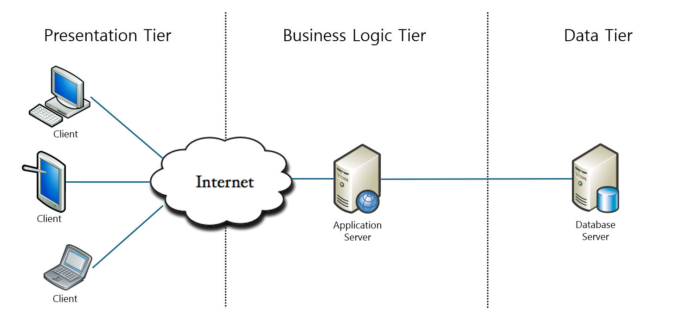

= 3-Tier 아키텍처

* 애플리케이션을 3개의 논리적/물리적인 계층으로 구성하는 확립된 소프트웨어 애플리케이션 아키텍처
** 일반 사용자가 애플리케이션과 상호작용하는 **프리젠테이션 계층**
** 서비스를 제공하고 데이터가 처리되는 ** 비즈니스 로직 계층**
** 관련된 데이터가 저장 및 관리되는 **데이터 계층**
* 각 계층이 자체 인프라에서 실행되므로 각 계층이 별도의 개발팀에 의해 동시에 개발될 수 있음
* 다른 계층에 영향을 주지 않고 필요에 따라 업데이트 되거나 확장될 수 있음

---

계층(Tier)는 책임을 분리하고 종속성을 관리하는 방법입니다. 각 계층에는 특정 책임이 있으며, 상위 계층은 하위 계층의 서비스를 사용할 수 있지만 그 반대로는 사용할 수 없습니다.

3-Tier 아키텍처는 n-tier 아키텍처의 일종으로, 애플리케이션을 프리젠테이션 계층(사용자 인터페이스), 서비스를 제공하고 데이터가 처리되는 비즈니스 로직 계층(또는 애플리케이션 계층), 그리고 관련 데이터가 저장되는 데이터 계층이라는 3개의 논리적이며 물리적으로 구분된 계층으로 구성하는 확립된 소프트웨어 애플리케이션 아키텍처입니다.

3-Tier 아키텍처는 각 계층이 자체 인프라에서 실행되므로 각 계층이 독립된 개발 팀에 의해 동시에 개발될 수 있으며, 다른 계층에 영향을 주지 않고 필요에 따라 업데이트되거나 확장될 수 있습니다.

수십 년 동안 3-Tier 아키텍처는 클라이언트-서버 애플리케이션의 지배적인 아키텍처였습니다. 현재 대부분의 3-Tier 애플리케이션은 현대화 대상이며 현대화에는 클라우드 네이티브 기술(예: 컨테이너 및 마이크로서비스)이 사용됩니다. 또한 이러한 3-Tier 애플리케이션은 클라우드로의 마이그레이션 대상이기도 합니다.

== 프리젠테이션 계층(Presentation Tier)

프레젠테이션 계층은 일반 사용자가 애플리케이션과 상호작용하는 애플리케이션의 사용자 인터페이스 및 커뮤니케이션을 담당하는 게층이며, 정보를 표시하고 사용자로부터 정보를 수집합니다. 이 최상위 레벨 계층은 예를 들어 웹 브라우저, 데스크탑 애플리케이션 또는 그래픽 사용자 인터페이스(GUI)에서 실행될 수 있습니다. 웹 프리젠테이션 계층은 일반적으로 Frontend 기술에 해당되는 HTML, CSS 및 JavaScript를 사용하여 개발됩니다. 데스크탑 애플리케이션은 플랫폼에 따라 다양한 언어로 작성될 수 있습니다.

== 비즈니스 로직 계층(Business Logic Tier)

Logical Tier 또는 Middle Tier, 또는 Application Tier 라고도 불리는 비즈니스 로직 계층은 애플리케이션의 핵심입니다. 이 계층에서는 특정 비즈니스 규칙 세트인 비즈니스 논리를 사용하여 프레젠테이션 계층에서 수집된 정보가 처리됩니다(경우에 따라 데이터 계층의 다른 정보와 관련하여 처리됨). 또한 애플리케이션 계층은 데이터 계층의 데이터를 추가, 삭제 또는 수정할 수도 있습니다. 

비즈니스 로직 계층은 일반적으로 Java, C#, Python, PHP, Ruby등을 사용하여 개발되며, API 호출을 사용하여 데이터 계층과 통신합니다. 

== 데이터 계층(Data Tier)

종종 데이터베이스 계층, 데이터 액세스 계층 또는 백엔드라고도 불리는 데이터 계층은 애플리케이션이 처리하는 정보가 저장 및 관리되는 계층입니다. 이는 관계형 데이터베이스 관리 시스템 (PostgreSQL, MySQL, MariaDB, Oracle, Microsoft SQL Server, Informix 등) 또는  NoSQL 데이터베이스 서버(예: Cassandra,  CouchDB 또는  MongoDB)일 수 있습니다. 

3-Tier 애플리케이션에서는 모든 통신이 애플리케이션 계층을 통과합니다. 프레젠테이션 계층과 데이터 계층은 서로 간에 직접 통신할 수 없습니다.

== 계층(Tier) vs. 레이어(Layer)

3-Tier 아키텍처에서, `레이어(Layer)` 는 종종 `계층(Tier)` 과 혼동되어 잘못 사용되지만, 이는 동일하지 않습니다. `레이어` 는 소프트웨어의 기능적 분할을 의미하지만, `계층` 은 다른 분할과 구분된 인프라에서 실행되는 소프트웨어의 기능적 분할을 의미합니다. 예를 들어, 전화기의 연락처 앱은 3개 레이어의 애플리케이션이지만 단일 계층 애플리케이션입니다. 세 개의 레이어가 모두 전화기에서 실행되기 때문입니다. 이런 유형의 애플리케이션을 올인원(All-in-One) 모놀리스 아키텍처라고 합니다.

증가하는 애플리케이션 복잡성을 관리하는 방법은 애플리케이션의 책임이나 문제에 따라 애플리케이션을 나누는 것입니다. 이 방법은 문제 분리 원칙을 따르며, 개발자가 특정 기능이 어디에 구현되는지 쉽게 찾을 수 있도록 증가하는 코드베이스를 정리하는데 도움이 됩니다. 

코드를 여러 레이어로 구성하면 공통 하위 수준 기능을 애플리케이션 전체에서 재사용할 수 있습니다. 이런 재사용은 작성할 코드의 양이 줄어들고 애플리케이션에서 반복 금지 원칙에 따라 단일 구현을 표현할 수 있다는 장점이 있습니다.

계층화 아키텍처를 사용하면 애플리케이션에서 다른 레이어와 통신할 수 있는 레이어를 제한할 수 있습니다. 이 아키텍처는 캡슐화를 달성하는 데 도움이 됩니다. 한 레이어가 변경되거나 대체되면 해당 레이어와 함께 작동하는 레이어만 영향을 받습니다. 어떤 레이어가 어떤 레이어에 종속되는지를 제한하면 단일 변경 내용이 전체 애플리케이션에 영향을 미치지 않도록 변경의 영향을 줄일 수 있습니다.

레이어(및 캡슐화)를 사용하면 애플리케이션 내에서 훨씬 간단하게 기능을 대체할 수 있습니다. 예를 들어 애플리케이션에서 처음에는 지속성을 위해 자체 SQL Server 데이터베이스를 사용하지만, 나중에는 클라우드 기반 지속성 전략 또는 웹 API 뒤에 있는 것을 사용할 수 있습니다. 애플리케이션이 논리적 계층 내에서 지속성 구현을 적절하게 캡슐화한 경우 해당 SQL Server 관련 계층을 동일한 퍼블릭 인터페이스를 구현하는 새 계층으로 바꿀 수 있습니다.

향후 요구 사항의 변화에 따라 구현을 교환할 가능성 외에도, 애플리케이션 레이어를 사용하면 테스트 목적으로 구현을 쉽게 교환할 수 있습니다. 애플리케이션의 실제 데이터 레이어 또는 UI 레이어에 대해 작동하는 테스트를 작성하는 대신, 테스트 시 이러한 레이어를 요청에 대한 알려진 응답을 제공하는 가짜 구현으로 바꿀 수 있습니다. 이 방법을 사용하면 일반적으로 애플리케이션의 실제 인프라에 대해 테스트를 실행할 때보다 테스트를 훨씬 쉽게 작성하고 훨씬 빠르게 실행할 수 있습니다.

논리적 레이어링은 엔터프라이즈 소프트웨어 애플리케이션에서 코드 구성을 향상하는 일반적인 방법이며, 코드를 레이어로 구성할 수 있는 여러 가지 방법이 있습니다.

레이어가 계층과 동일한 이점을 제공할 수 없으므로, 이 차이점은 중요합니다.

== 3-Tier 아키텍처의 장점

3-Tier 아키텍처의 주요 장점은 기능의 논리적 및 물리적 분리입니다. 각 계층은 기능적 요구 사항에 가장 적합한 별도의 운영 체제와 서버 플랫폼(예: 웹 서버, 애플리케이션 서버, 데이터베이스 서버)에서 실행될 수 있습니다. 그리고 각 계층이 하나 이상의 전용 서버 하드웨어 또는 가상 서버에서 실행되므로, 다른 계층에 영향을 주지 않고도 각 계층의 서비스를 사용자 정의하고 최적화할 수 있습니다. 

기타 장점(단일 또는 2계층 아키텍처와 비교할 경우)에는 다음이 포함됩니다.

* **빠른 개발** 각 계층이 서로 다른 팀에서 동시에 개발될 수 있으므로, 기업은 애플리케이션을 보다 빠르게 시장에 출시할 수 있으며 프로그래머는 각 계층에 최신 및 최상의 언어와 툴을 사용할 수 있습니다.
* **개선된 확장성** 필요에 따라 어느 계층이든 다른 계층과 독립적으로 확장할 수 있습니다.
* **개선된 신뢰성** 한 계층의 가동 중단은 다른 계층의 가용성 또는 성능에 별로 영향을 미치지 않습니다.
* **개선된 보안** 프레젠테이션 계층과 데이터 계층이 직접 통신할 수 없으므로, 잘 설계된 애플리케이션 계층은 내부 방화벽의 일종으로 작동하여 SQL 인젝션 및 기타 악의적 공격을 방지할 수 있습니다.

== 웹 개발의 3-Tier 애플리케이션

웹 개발에서 계층은 서로 다른 이름을 갖지만 유사한 기능을 수행합니다.

웹 서버는 프레젠테이션 계층이며 사용자 인터페이스를 제공합니다. 이는 일반적으로 사용자가 장바구니에 상품을 추가하거나 지불 정보를 추가하거나 계정을 작성하는 전자상거래 사이트와 같은 웹 페이지 또는 웹 사이트입니다. 콘텐츠는 정적 또는 동적일 수 있으며, 이는 일반적으로 Frontend 기술인 HTML, CSS 및 Javascript를 사용하여 개발되며, React, Vue.js 등의 프레임워크도 사용됩니다

애플리케이션 서버 는 사용자 입력을 처리하는 데 사용되는 비즈니스 논리를 수용하는 중간 계층에 해당합니다. 전자상거래 사례를 계속하자면, 이는 인벤토리 데이터베이스를 조회하여 제품 가용성을 리턴하거나 고객 프로파일에 세부사항을 추가하는 계층입니다. 이 레이어는 Java, C#, , Python, PHP등의 언어를 사용하여 개발되며, Spring, ASP.NET, Django, Rails, 등의 프레임워크를 실행합니다.

데이터베이스 서버 는 웹 애플리케이션의 데이터 또는 백엔드 계층입니다. 이 서버는 데이터베이스 관리 소프트웨어(예: MySQL, Oracle, DB2 또는 PostgreSQL)에서 실행됩니다.

link:./03_client_server.adoc[이전: 클라이언트 서버 아키텍처] +
link:./05_n-tier_architecture.adoc[다음: n-Tier 아키텍처]