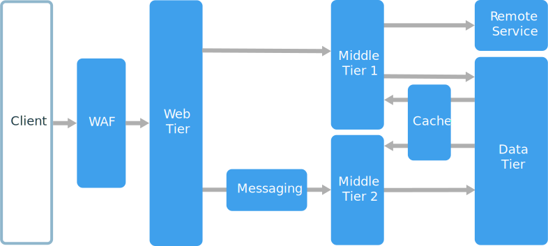

= N-Tier 아키텍처

* 둘 이상의 계층을 갖는 모든 애플리케이션 아키텍처를 의미
** 각 계층에는 특정 책임이 존재하며, 상위 계층은 하위 계층의 서비스를 사용할 수 있으나, 반대로는 사용할 수 없음
** 계층은 물리적으로 분리되어 별도의 컴퓨터에서 실행
* 닫힌 레이어 아키텍처(Closed Layer Architecture)와 개방 레이어 아키텍처(Open Layer Architecture)
** 닫힌 계층 아키텍처에서 계층은 다음 계층만을 호출할 수 있음
** 개방형 계층 아키텍처에서 계층은 아래 계층 중 어느 계층을 호출할 수 있음: 

---

n-Tier 아키텍처는 일반적으로 3-Tier 아키텍처를 사용하지만, 3-Tier 아키텍처 애플리케이션 보다 복잡한 애플리케이션은 그 이상의 계층이 있을 수 있습니다. 서로 다른 기능 영역을 캡슐화 해야하는 필요가 있을 경우, 위 그림처럼 두 개의 중간 계층이 존재하는 애플리케이션 아키텍처를 구성할 수 있습니다.

n-Tier 애플리케이션에는 닫힌 레이어 아키텍처(Closed Layer Architecture)와 개방 레이어 아키텍처(Open Layer Architecture)가 있을 수 있습니다. 

* 닫힌 레이어 아키텍처에서, 레이어는 바로 아래 레이어만을 호출할 수 있습니다. 이 아키텍처는 레이어간의 종속성을 제한합니다.
* 개방 레이어 아키텍처에서, 레이어에서는 종속성을 제한하지 않지만 불필요한 네트워크 트래픽을 줄일 수 있습니다.

link:./04_3_tier_architecture.adoc[이전: 3-Tier 아키텍처] +
link:./06_horizontal_scalability.adoc[다음: 애플리케이션 수평 확장]