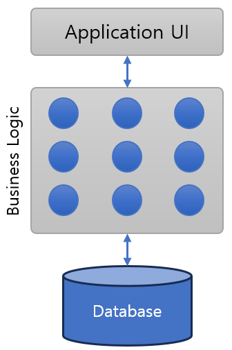
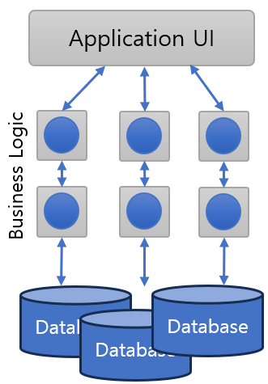

= 웹 애플리케이션 아키텍처

* 웹 개발에서 3-Tier 아키텍처
** **웹 서버** + 
프리젠테이션 계층이며, 사용자 인터페이스를 제공, 일반적으로 HTML, CSS, JavaScript등의 Frontend 기술을 사용
** **애플리케이션 서버** +
비즈니스 로직을 실행하는 중간 계층(Middle Tier)에 해당하며, Java, C#, , Python, PHP등의 언어를 사용하여 개발되며, Spring, ASP.NET, Django, Rails, 등의 프레임워크를 실행
** **데이터베이스 서버** +
웹 애플리케이션의 데이터 또는 백엔드 계층이며, 데이터베이스 관리 시스템(DBMS)에서 실행됨
* 웹 애플리케이션에서 수평 확장
** 애플리케이션 서버를 추가로 설치하여 수평확장 구현
** 여러 서버를 하나의 서버처럼 활용하기 위한 클러스터링 구성
** Load Balancing 작업 필요
* 마이크로서비스 아키텍처에서 웹 애플리케이션
** 각 웹 서버가 독립된 서비스 형태로 존재
** API Gateway를 중심으로 n-tier 아키텍처 구성
** 일반적으로 각 서비스는 RESTful API 방식으로 통신

---

== 모놀리식 애플리케이션

모놀리식 애플리케이션은 동작 관점에서 완전이 독립적인 애플리케이션을 말합니다. 작업을 수행하는 과정에서 다른 서비스 또는 데이터 저장소에 액세스 할 수도 있으나, 동작은 자체 프로세스 내에서 실행되고 전체 애플리케이션을 일반적으로 하나의 단위로 배포됩니다. 이런 애플리케이션을 수평으로 확장해야 하는 경우 일반적으로 전체 애플리케이션이 여러 서버에서 중복됩니다.

== 마이크로서비스 애플리케이션

마이크로서비스 아키텍처는 작은 자율 서비스(autonomous service)의 모음으로 구성됩니다. 각 서비스는 독립적으로 동작하며, 컨텍스트 내에서 단일 비즈니스 기능을 구현합니다.

== 일반적인 웹 애플리케이션 구성요소

* Application UI (Presentation Tier 또는 Layer)
** 웹 브라우저에서 보여질 문서, 이미지, 스크립트 등
** HTML documents / Image Files / JavaScript
* Business Logic (Business Logic Tier 또는 Layer)
** Web Server와 동적 웹을 생성하는 Web Application Server
** Apache / Nginx / IIS / Tomcat 등
* Database (Data Tier 또는 Layer)
** 데이터베이스 관리 시스템
** Oracle, Microsoft SQL Server, MySQL, PostgreSQL, NoSQL 등

link:./07_microservice.adoc[이전: 마이크로서비스 아키텍처] +
link:./09_review.adoc[다음: 검토]