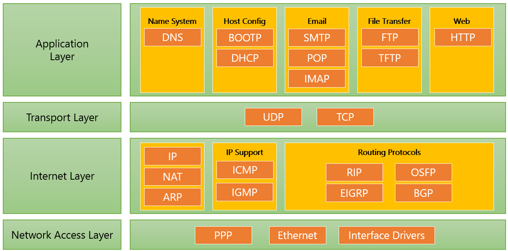

= Web Server 개요

* HTTP 또는 HTTPS를 통해 웹 브라우저 또는 프로그램에서 요청에 응답하여 요청 결과를 전송하는 서비스 프로그램
** HTTP/HTTPS 프로토콜을 사용
** 웹 브라우저 요청에 대한 응답을 전송
* 응답 유형
** HTML document
** 이미지, 파일
** HTTP 상태 코드
** 요청 결과(JSON, XML 등)

---

Web Server는 HTTP

https://ko.wikipedia.org/wiki/%EC%9B%B9_%EC%84%9C%EB%B2%84

link:./06_web_server.adoc[이전: Web Server] +
link:./08_web_server_functions.adoc[다음: Web Server의 기능]