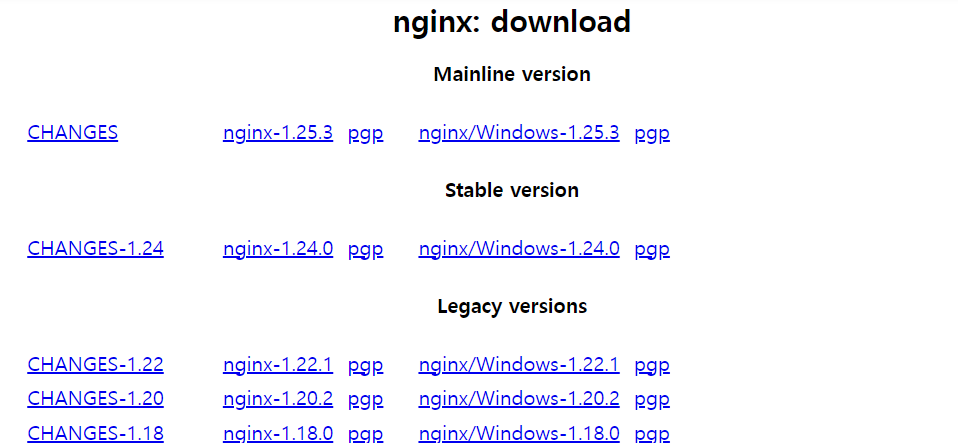
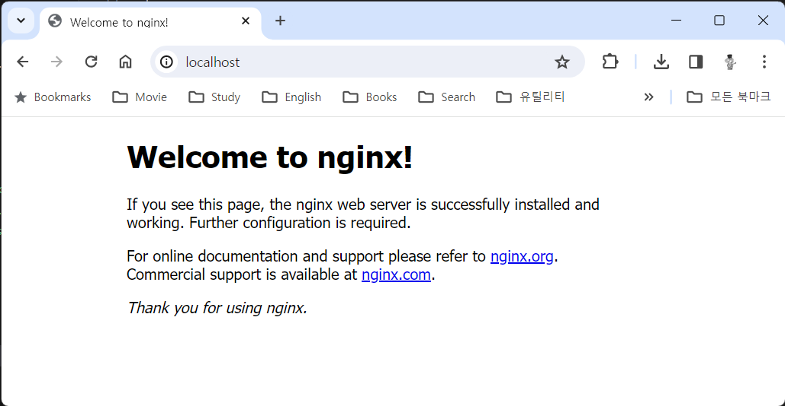
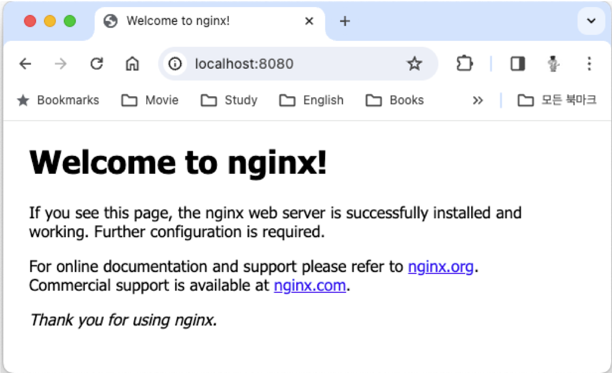

= Lab 2-1 Web Server 설치

이 연습에서는 Nginx와 Apache 웹 서버를 설치합니다. 아래 절차에 따릅니다.

== Nginx 설치

이 연습에서는 Windows, macOS, Linux(Ubuntu) 운영체제에 Nginx 웹 서버를 설치합니다. 

=== Windows 운영체제에 Nginx 웹 서버 설치

1. 웹 브라우저를 실행하고 Nginx 다운로드 페이지로 이동합니다.
+
link:./https://nginx.org/en/download.html[https://nginx.org/en/download.html]
+
2. Stable version Nginx 다운로드 링크를 클릭하여 다운로드합니다.
+

+
3. 다운로드한 파일을 c:\nginx 폴더에 압축 해제합니다.
4. 명령 프롬프트를 실행합니다.
5. c:\nginx 폴더로 이동하고, 폴더 내의 nginx-<version number> 폴더로 이동합니다.
+
----
c:\> cd nginx\nginx-1.24.0
----
+
6. 아래 명령을 실행하여 Nginx 웹 서버를 시작합니다.
+
----
c:\nginx\nginx-1.24.0> start nginx
----
+
7. 아래 명령을 실행하여 실행중인 Nginx 웹 서버에 접속합니다.
+
----
> curl localhost
<!DOCTYPE html>
<html>
<head>
<title>Welcome to nginx!</title>

</head>
<body>
<h1>Welcome to nginx!</h1>

If you see this page, the nginx web server is successfully installed and
working. Further configuration is required.

For online documentation and support please refer to
<a href="http://nginx.org/">nginx.org</a>. 
Commercial support is available at
<a href="http://nginx.com/">nginx.com</a>.

<em>Thank you for using nginx.</em>

</body>
</html>
----
+
8. 웹 브라우저를 실행하고, 주소창에 localhost를 입력하고 이동하여 실행중인 Nginx를 확인합니다.
+

+
9. 아래 명령을 실행하여 Nginx 웹 서버를 종료합니다.
+
----
c:\nginx\nginx-1.24.0> nginx -s quit
----
+
[col="1a"]
|===
|**참고** Windows에서 Nginx 시작과 종료 명령은 다음과 같습니다. +
start nginx       // 시작 +
nginx -s stop     // 빠른 종료 +
nginx -s quit     // 일반 종료 +
nginx -s reload   // 리로드
|===

=== macOS 운영체제에 Nginx 설치

1. 터미널을 실행합니다.
2. 아래 명령을 실행하여 homebrew에서 nginx를 검색합니다.
+
----
% brew search nginx
==> Formulae
nginx
----
+
3. 아래 명령을 실행하여 nginx를 설치합니다.
+
----
% brew install nginx
----
+
4. 설치가 완료되면, 아래 명령을 실행하여 nginx를 시작합니다.
+
----
% brew services start nginx
==> Successfully started `nginx` (label: homebrew.mxcl.nginx)
----
+
5. 아래 명령을 실행하여 실행중인 Nginx 웹 서버에 접속합니다.
+
----
% curl localhost:8080
<!DOCTYPE html>
<html>
<head>
<title>Welcome to nginx!</title>

</head>
<body>
<h1>Welcome to nginx!</h1>

If you see this page, the nginx web server is successfully installed and
working. Further configuration is required.

For online documentation and support please refer to
<a href="http://nginx.org/">nginx.org</a>. 
Commercial support is available at
<a href="http://nginx.com/">nginx.com</a>.

<em>Thank you for using nginx.</em>

</body>
</html>
----
+
6. 웹 브라우저를 실행하고, 주소창에 localhost:8080을 입력하고 이동하여 실행중인 Nginx를 확인합니다.
+ 

+
7. 아래 명령을 실행하여 실행중인 Nginx를 중지합니다.
+
----
% brew services stop nginx
Stopping `nginx`... (might take a while)
==> Successfully stopped `nginx` (label: homebrew.mxcl.nginx)
----
