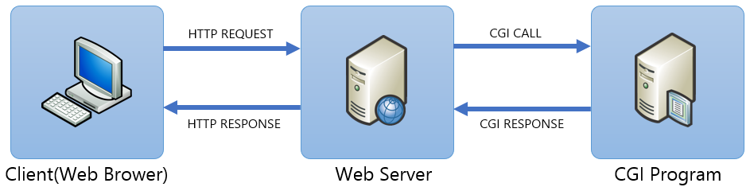

= CGI(Common Gateway Interface) 개요

* 서버와 애플리케이션간에 데이터를 주고 받는 방벙에 대한 명세
* 웹 서버가 **외부 프로그램**을 실행할 수 있도록 해 주는 인터페이스 명세(specification)
** 웹 서버 외부에 존재하는 CGI 프로그램이 동적 웹 콘텐츠를 생산

* 환경 변수나 표준 입출력을 다룰 수 있는 언어라면 어떤 언어든지 확장하여 사용가능
* 실행 속도나 텍스트 처리의 용이함 등을 이유로 perl, python, ruby등의 스크립트 언어가 주로 사용됨

---

* 컴파일 방식
** 기계어. 컴파일된 상태
** c++, c
* 인터프리터 방식
** 스크립트 언어
** Asp, Php, Python, Per
** 스크립트 엔진
*** 해당 스크립트를 실행할 수 있는 엔진
** 즉시 코드를 수정할 수 있음

link:./11_cgi.adoc[이전: CGI (Common Gateway Inteface)] +
link:./13_cgi_spec.adoc[다음: CGI Specification]