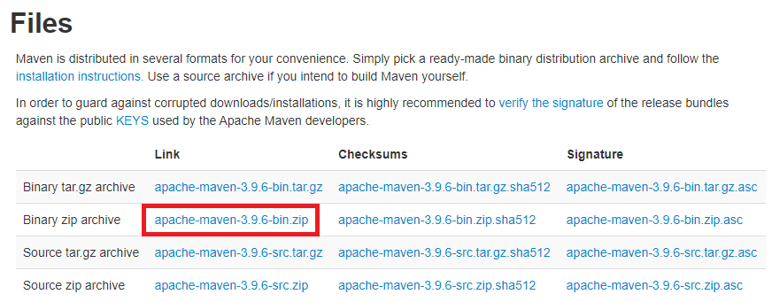

= Lab 2-2 간단한 Java CGI 애플리케이션 작성

이 연습에서는 간단한 Java CGI 애플리케이션을 작성합니다. 아래 절차에 따릅니다.

== 환경 설정

이 연습에서는 자동화 된 빌드를 위해 Maven을 사용합니다. Visual Studio Code에서 Maven 빌드를 위해서는 Apache Maven이 필요합니다. 여기에서는 Apache Maven을 다운로드하여 설치하고, Visual Studio Code에서 Maven 빌드 환경을 설정합니다.

=== Windows에서 Apache Maven 설치

이 연습에서는 Windows에서 Visual Studio Code를 위한 Maven 빌드 환경을 구성합니다. 아래 절차에 따릅니다.

1. 웹 브라우저를 실행하고 Apache Maven 다운로드 사이트로 이동합니다.
+
https://maven.apache.org/download.cgi
+
2. Files 구역에서 Binary zip archive를 다운로드 합니다.
+

+
3. 다운로드 한 파일을 압축해제 합니다. 
4. 압축이 해제된 폴드에서 apache-maven-<version>-bin 폴더 내의 apache-maven-<version> 폴더를 C 드라이브 루트로 복사합니다.
5. 복사된 폴더는 아래와 같은 구조이며, 4개의 하위 폴더를 포함하고 있어야 합니다.
+
image:./images/image14.png[]

=== macOS에서 Apache Maven 설치

이 연습에서는 macOS에서 Visual Studio Code를 위한 Maven 빌드 환경을 구축합니다. 아래 절차에 따릅니다.

1. 터미널을 실행합니다.
2. 아래 명령을 실행하여 Apache Maven을 설치합니다.
+
----
% brew install mvn
----
+
3. 아래 명령을 실행하여 설치된 Maven의 버전을 확인합니다.
+
----
% mvn -version
Apache Maven 3.9.6 (bc0240f3c744dd6b6ec2920b3cd08dcc295161ae)
Maven home: /opt/homebrew/Cellar/maven/3.9.6/libexec
Java version: 21.0.2, vendor: Eclipse Adoptium, runtime: /Library/Java/JavaVirtualMachines/temurin-21.jdk/Contents/Home
Default locale: ko_KR, platform encoding: UTF-8
OS name: "mac os x", version: "14.2.1", arch: "aarch64", family: "mac"
----
+
4. 아래 명령을 실행하여 Maven의 정보를 확인합니다.
+
----
% brew info mvn
Java-based project management
https://maven.apache.org/
Conflicts with:
  mvnvm (because also installs a 'mvn' executable)
/opt/homebrew/Cellar/maven/3.9.6 (92 files, 10.4MB) *
  Poured from bottle using the formulae.brew.sh API on 2024-02-01 at 19:10:55
From: https://github.com/Homebrew/homebrew-core/blob/HEAD/Formula/m/maven.rb
License: Apache-2.0
==> Dependencies
Required: openjdk ✔
==> Analytics
install: 28,304 (30 days), 94,539 (90 days), 349,701 (365 days)
install-on-request: 28,072 (30 days), 93,857 (90 days), 347,434 (365 days)
build-error: 0 (30 days)
----
+
5. Maven이 설치된 디렉터리를 확인합니다.
+
----
% ls -l /opt/homebrew/Cellar/maven/3.9.6/libexec
total 0
drwxr-xr-x   6 gikpreet  admin   192 11 28 18:59 bin
drwxr-xr-x   4 gikpreet  admin   128 11 28 18:59 boot
drwxr-xr-x   5 gikpreet  admin   160 11 28 18:59 conf
drwxr-xr-x  73 gikpreet  admin  2336 11 28 18:59 lib
----
+
6. 아래 명령을 실행하여 settings.xml 파일의 위치를 확인합니다.
+
----
% ls -l /opt/homebrew/Cellar/maven/3.9.6/libexec/conf
total 32
drwxr-xr-x  3 gikpreet  admin     96 11 28 18:59 logging
-rw-r--r--  1 gikpreet  admin  10528 11 28 18:59 settings.xml
-rw-r--r--  1 gikpreet  admin   3645 11 28 18:59 toolchains.xml
----
+ 
7. 아래 명령을 실행하여 mvn 파일의 위치를 확인합니다.
+
----
% ls -l /opt/homebrew/Cellar/maven/3.9.6/libexec/bin   
total 40
-rw-r--r--  1 gikpreet  admin   327 11 28 18:59 m2.conf
-rwxr-xr-x  1 gikpreet  admin  5883 11 28 18:59 mvn
-rwxr-xr-x  1 gikpreet  admin  1684 11 28 18:59 mvnDebug
-rwxr-xr-x  1 gikpreet  admin  1611 11 28 18:59 mvnyjp
----

==== Visual Studio Code에서 Maven 환경설정

아 연습에서는 Visual Studio Code에서 Maven 실행 환경을 구성합니다. 아래 절차에 따릅니다.

1. Visual Studio Code를 실행합니다.
2. **File (파일)** 메뉴에서 **Preferance (기본 설정)**을 클릭합니다.
3. Settings 탭에서 Search settins에서 Maven을 입력하고 설정을 검색합니다.
4. **Java > Configuration > Maven: User Settings** 설정에는 Apache Maven의 설정 파일인 settings.xml 파일의 위치가 구성되어야 합니다. settings.xml 파일의 위치를 아래와 같이 설정합니다. +
**Windows Visual Studio Code 에서**
+
----
C:\apache-maven-3.9.6\conf\settings.xml
----
+
**macOS Visual Studio Code 에서**
+
----
/opt/homebrew/Cellar/maven/3.9.6/libexec/conf/settings.xml
----
+
5. **Maven > Excutable: Path**에는 Apache Maven의 실행 경로인 mvn.cmd(Windows) 또는 mvn(macOS 또는 Linux) 파일의 위치가 구성되어야 합니다. mvn.cmd/mvn 파일의 위치를 아래와 같이 설정합니다. +
**Windows Visual Studio Code 에서**
+
----
C:\apache-maven-3.9.6\bin\mvn.cmd
----
+
**macOS Visual Studio Code 에서**
+
----
/opt/homebrew/Cellar/maven/3.9.6/libexec/bin/mvn
----

