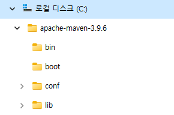
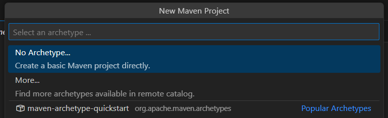

= Lab 2-2 간단한 Java CGI 애플리케이션 작성

이 연습에서는 간단한 Java CGI 애플리케이션을 작성합니다. 아래 절차에 따릅니다.

== 연습 1: 환경 설정

이 연습에서는 자동화 된 빌드를 위해 Maven을 사용합니다. Visual Studio Code에서 Maven 빌드를 위해서는 Apache Maven이 필요합니다. 여기에서는 Apache Maven을 다운로드하여 설치하고, Visual Studio Code에서 Maven 빌드 환경을 설정합니다.

=== Windows에서 Apache Maven 설치

이 연습에서는 Windows에서 Visual Studio Code를 위한 Maven 빌드 환경을 구성합니다. 아래 절차에 따릅니다.

1. 웹 브라우저를 실행하고 Apache Maven 다운로드 사이트로 이동합니다.
+
https://maven.apache.org/download.cgi
+
2. Files 구역에서 Binary zip archive를 다운로드 합니다.
+
image:./images/image13.png[]
+
3. 다운로드 한 파일을 압축해제 합니다. 
4. 압축이 해제된 폴드에서 apache-maven-<version>-bin 폴더 내의 apache-maven-<version> 폴더를 C 드라이브 루트로 복사합니다.
5. 복사된 폴더는 아래와 같은 구조이며, 4개의 하위 폴더를 포함하고 있어야 합니다.
+

=== macOS에서 Apache Maven 설치

이 연습에서는 macOS에서 Visual Studio Code를 위한 Maven 빌드 환경을 구축합니다. 아래 절차에 따릅니다.

1. 터미널을 실행합니다.
2. 아래 명령을 실행하여 Apache Maven을 설치합니다.
+
----
% brew install mvn
----
+
3. 아래 명령을 실행하여 설치된 Maven의 버전을 확인합니다.
+
----
% mvn -version
Apache Maven 3.9.6 (bc0240f3c744dd6b6ec2920b3cd08dcc295161ae)
Maven home: /opt/homebrew/Cellar/maven/3.9.6/libexec
Java version: 21.0.2, vendor: Eclipse Adoptium, runtime: /Library/Java/JavaVirtualMachines/temurin-21.jdk/Contents/Home
Default locale: ko_KR, platform encoding: UTF-8
OS name: "mac os x", version: "14.2.1", arch: "aarch64", family: "mac"
----
+
4. 아래 명령을 실행하여 Maven의 정보를 확인합니다.
+
----
% brew info mvn
Java-based project management
https://maven.apache.org/
Conflicts with:
  mvnvm (because also installs a 'mvn' executable)
/opt/homebrew/Cellar/maven/3.9.6 (92 files, 10.4MB) *
  Poured from bottle using the formulae.brew.sh API on 2024-02-01 at 19:10:55
From: https://github.com/Homebrew/homebrew-core/blob/HEAD/Formula/m/maven.rb
License: Apache-2.0
==> Dependencies
Required: openjdk ✔
==> Analytics
install: 28,304 (30 days), 94,539 (90 days), 349,701 (365 days)
install-on-request: 28,072 (30 days), 93,857 (90 days), 347,434 (365 days)
build-error: 0 (30 days)
----
+
5. Maven이 설치된 디렉터리를 확인합니다.
+
----
% ls -l /opt/homebrew/Cellar/maven/3.9.6/libexec
total 0
drwxr-xr-x   6 gikpreet  admin   192 11 28 18:59 bin
drwxr-xr-x   4 gikpreet  admin   128 11 28 18:59 boot
drwxr-xr-x   5 gikpreet  admin   160 11 28 18:59 conf
drwxr-xr-x  73 gikpreet  admin  2336 11 28 18:59 lib
----
+
6. 아래 명령을 실행하여 settings.xml 파일의 위치를 확인합니다.
+
----
% ls -l /opt/homebrew/Cellar/maven/3.9.6/libexec/conf
total 32
drwxr-xr-x  3 gikpreet  admin     96 11 28 18:59 logging
-rw-r--r--  1 gikpreet  admin  10528 11 28 18:59 settings.xml
-rw-r--r--  1 gikpreet  admin   3645 11 28 18:59 toolchains.xml
----
+ 
7. 아래 명령을 실행하여 mvn 파일의 위치를 확인합니다.
+
----
% ls -l /opt/homebrew/Cellar/maven/3.9.6/libexec/bin   
total 40
-rw-r--r--  1 gikpreet  admin   327 11 28 18:59 m2.conf
-rwxr-xr-x  1 gikpreet  admin  5883 11 28 18:59 mvn
-rwxr-xr-x  1 gikpreet  admin  1684 11 28 18:59 mvnDebug
-rwxr-xr-x  1 gikpreet  admin  1611 11 28 18:59 mvnyjp
----

==== Visual Studio Code에서 Maven 환경설정

아 연습에서는 Visual Studio Code에서 Maven 실행 환경을 구성합니다. 아래 절차에 따릅니다.

1. Visual Studio Code를 실행합니다.
2. **File (파일)** 메뉴에서 **Preferance (기본 설정)**을 클릭합니다.
3. Settings 탭에서 Search settins에서 Maven을 입력하고 설정을 검색합니다.
4. **Java > Configuration > Maven: User Settings** 설정에는 Apache Maven의 설정 파일인 settings.xml 파일의 위치가 구성되어야 합니다. settings.xml 파일의 위치를 아래와 같이 설정합니다. +
**Windows Visual Studio Code 에서**
+
----
C:\apache-maven-3.9.6\conf\settings.xml
----
+
**macOS Visual Studio Code 에서**
+
----
/opt/homebrew/Cellar/maven/3.9.6/libexec/conf/settings.xml
----
+
5. **Maven > Excutable: Path**에는 Apache Maven의 실행 경로인 mvn.cmd(Windows) 또는 mvn(macOS 또는 Linux) 파일의 위치가 구성되어야 합니다. mvn.cmd/mvn 파일의 위치를 아래와 같이 설정합니다. +
**Windows Visual Studio Code 에서**
+
----
C:\apache-maven-3.9.6\bin\mvn.cmd
----
+
**macOS Visual Studio Code 에서**
+
----
/opt/homebrew/Cellar/maven/3.9.6/libexec/bin/mvn
----

== 연습 2 간단한 Java CGI 애플리케이션 작성

이 연습에서는 간단한 Java CGI 애플리케이션을 작성합니다. 아래 절차에 따릅니다.

=== Project 생성

1. Visual Studio Code를 실행합니다.
2. **View(보기)** 메뉴에서 **Command Palette(명령 팔레트)**를 클릭합니다.
3. Command Palette에서 Java: Create Java Project를 검색하고 선택합니다.
+
image:./images/image15.png[]
+
4. Select the project type에서 **Maven**을 선택합니다.
+

+
5. Select an archetype에서 **No Archetype**을 선택합니다.
+

+
6. group id로 **com.nhnacademy**를 입력하고 Enter 키를 누릅니다.
+
image:./images/image18.png[]
+
7. artifact Id로 **cgi**를 입력하고 Enter 키를 누릅니다.
+

+
8. 폴더 선택 윈도우에서 프로젝트가 위치할 폴더를 선택하고 **Select Destination Folder** 버튼을 클릭합니다.
9. 아래쪽 정보 팡에서 Open 버튼을 클릭합니다.
+

+
10. 신뢰 정보 경고 창에서 Yes, I trust the authors 버튼을 클릭합니다.

=== Dependency 설정

여기에서는 프로젝트 빌드에 필요한 프로젝트 구성요소들의 Dependendy를 Maven을 이용해 설정합니다. 아래 절차에 따릅니다.

1. Visual Studio Code의 Exploer 패널에서 pom.xml 파일을 엽니다.
2. </properties> 요소 아래에 아래 Dependency를 삽입하고 저장합니다.
+
[source, xml]
----
    <dependencies>
        <dependency>
            <groupId>com.beust</groupId>
            <artifactId>jcommander</artifactId>
            <version>1.82</version>
        </dependency>
    </dependencies>

    <build>
        <plugins>
            <plugin>
                <groupId>org.apache.maven.plugins</groupId>
                <artifactId>maven-shade-plugin</artifactId>
                <executions>
                    <execution>
                        <goals>
                            <goal>shade</goal>
                        </goals>
                        <configuration>
                            <finalName>cgi-shade</finalName>
                            <shadedArtifactAttached>true</shadedArtifactAttached>
                            <transformers>
                                <transformer implementation="org.apache.maven.plugins.shade.resource.ManifestResourceTransformer">
                                    <mainClass>com.nhnacademy.Main</mainClass>
                                </transformer>
                            </transformers>
                        </configuration>
                    </execution>
                </executions>
            </plugin>
        </plugins>
    </build>
----

=== 소스코드 작성

1. Visual Studio Code의 Exploer 패널에서 cgi > src > main > java \ com \ nhnacademy를 클릭하고 새로 만들기 버튼을 클릭한 후 CgiArgs.java 파일을 생성합니다.
+

+
2. CgiArgs 클래스는 JCommander 패키지의 Parameter 어노테이션을 사용합니다. package 선언 아래에 아래 import 문을 선언합니다.
+
[source, java]
----
import com.beust.jcommander.Parameter;
----
+
3. CgiArgs 클래스는 CGI specification을 위해 여러 변수를 선언하고 각 변수의 getter를 구현합니다. CgiArgs 클래스를 아래와 같이 작성합니다. CgiArgs.java 파일의 전체 소스코드는 아래와 같습니다.
+
[source, java]
----
package com.nhnacademy;

import com.beust.jcommander.Parameter;

public class CgiArgs {
    @Parameter(names = {"-content-type"})
    private String contentType;

    @Parameter(names = {"-method","method"})
    private String method;

    @Parameter(names ={"-query-string"} )
    private String queryString;

    @Parameter(names = {"-server-name"})
    private String serverName;

    @Parameter(names = {"-server-port"})
    private String port;

    @Parameter(names = {"-path"})
    private String path;

    @Parameter(names = {"-body"})
    private String body;

    public String getContentType() {
        return contentType;
    }

    public String getMethod() {
        return method;
    }

    public String getQueryString() {
        return queryString;
    }

    public String getServerName() {
        return serverName;
    }

    public String getPort() {
        return port;
    }

    public String getPath() {
        return path;
    }

    public String getBody() {
        return body;
    }
}
----
+
4. Main.java 파일을 열고 아래와 같이 코드를 작성합니다. 응용 프로그램은 JCommander 객체를 사용하여 CgiArgs 객체를 CGI Specification에 맞게 처리합니다. Main.java 파일의 전체 소스코드는 아래와 같습니다.
+
[source, java]
----
package com.nhnacademy;

import com.beust.jcommander.JCommander;

public class Main {
    public static void main(String[] args) {
        CgiArgs cgiArgs = new CgiArgs();

        JCommander.newBuilder()
                .addObject(cgiArgs)
                .build()
                .parse(args);

        System.out.println("content-type:" + cgiArgs.getContentType());
        System.out.println("method:" + cgiArgs.getMethod());
        System.out.println("query-string:" + cgiArgs.getQueryString());
        System.out.println("server-name:" + cgiArgs.getServerName());
        System.out.println("server-port:" + cgiArgs.getPort());
        System.out.println("path:" + cgiArgs.getPath());
        System.out.println("body:" + cgiArgs.getBody());
    }
}
----
+
5. Visual Studio Code의 Exploer 패널에서 cgi 폴더를 선택하고  새로 만들기 버튼을 클릭한 후 Windows에서는 java.cgi.bat, macOS와 Linux에서는 java.cgi.sh 파일을 생성합니다.
6. 생성한 파일을 열고 아래와 같이 실행 스크립트를 작성합니다.
+
**Windows(java.cgi.bat)** +
----
@ECHO OFF

java -jar ./target/cgi-shade.jar  ^
     -content-type text/html ^
     -method get ^
     -query-string "?page=2&id=marco" ^
     -server-name my-server ^
     -server-port 8080 ^
     -path /index.html ^
     -body hello
----
+
**macOS, Linux(java.cgi.sh)**
----
java -jar ../../target/cgi-shade.jar  \
     -content-type text/html \
     -method get \
     -query-string '?page=2&id=marco' \
     -server-name my-server \
     -server-port 8080 \
     -path /index.html \
     -body hello
----
+

=== 프로젝트 빌드

1. Visual Studio Code의 Terminal 메뉴에서 **Run Build Task(빌드 작업 실행)**를 클릭합니다.
+

+
2. Command Palette에서 **java (build): Build WOrkspace**를 클릭합니다.
+

+
3. Visual Studio Code 오른쪽의 Exploer 패널에서 target > classes \ com \ nhnacademy 아래에서 빌드된 .class 파일을 확인합니다.
+

+
4. Visual Studio Code 오른쪽 아래의 **MAVEN** 패널을 확장하고 **cgi** 항목을 마우스 오른쪽 클릭한 후 **Run Maven Commands...** > **install**을 클릭합니다.
+

+
5. Explorer 패널에서 빌드 결과를 확인합니다. target 폴더에 cgi-shade.jar 파일이 생성된 것을 확인합니다.
+

+
6. 터미널에서 java.cgi.bat(Windows에서) / java.cgi.sh(macOS 또는 Linux에서) 파일을 실행합니다.
+
**Windows**
----
C:\Lab2-2\cgi>java.cgi.bat
content-type:text/html
method:get
query-string:?page=2&id=marco
server-name:my-server
server-port:8080
path:/index.html
body:hello
----
+
**macOS / Linux**
----
cgi % ./java.cgi.sh
content-type:text/html
method:get
query-string:?page=2&id=marco
server-name:my-server
server-port:8080
path:/index.html
body:hello
----
+
7. 연습이 종료되었습니다.

link:./fast_cgi.adoc[이전: Fast CGI] +
link:./