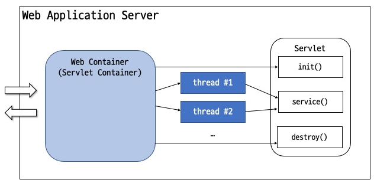

= Servlet Architecture

* 웹 컨테이너(서블릿 컨테이너)는 웹 서버 구성요소중 하나라 Java Servlet과 상호작용
* 웹 컨테이너는 서블릿의 생명주기를 관리하고, URL과 특정 서블릿을 매핑하여 URL 요청이 올바른 접근 권한을 갖도록 보장함
* 웹 컨테이너는 Servlet, Java Server Page(JSP) 파일, Server-side 코드가 포함된 다른 타입들의 파일들에 대한 요청을 다름
* 웹 컨테이너는 Servlet 객체를 생성하고, Servlet을 로드하며, 요청과 응답 객체를 관리하고 다른 Servlet 관리 작업을 수행함
* 웹 컨테이너는 웹 구성요소 Java EE 아키텍처 제약을 구현하고, 보안, 동시성(concurrency), 생명주기 관리, 트랜잭션, 배포 등 다른 서비스를 포함하는 웹 구성요소의 실행 환경을 명세함

---