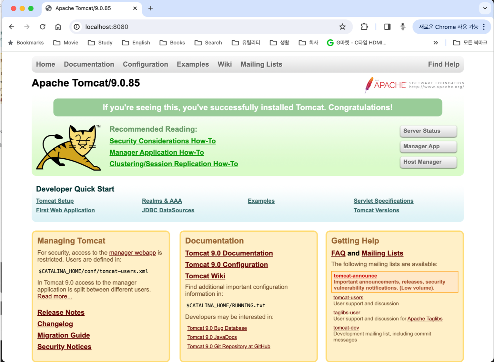
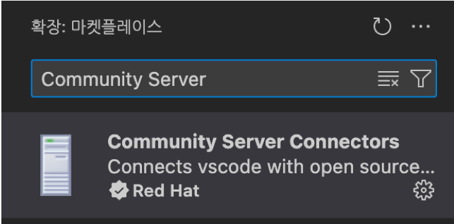
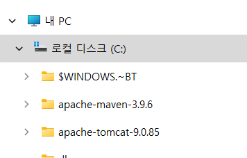

= Lab 2-3: 간단한 Java Servlet 프로그램 작성

== Tomcat 설치

=== Windows에서 Tomcat 설치

=== macOS에서 Tomcat 설치

1. 터미널을 실행합니다.
2. 아래 명령을 실행하여 homebrew를 업데이트 합니다.
+
----
$ brew update
----
+
3. 아래 명령을 실행하여 tomcat 9 버전을 설치합니다.
+
----
$ brew install tomcat@9
----
+
4. 아래 명령을 실행하여 설치된 tomcat 정보를 확인합니다.
+
----
$ brew info tomcat@9
==> tomcat@9: stable 9.0.85 (bottled) [keg-only]
Implementation of Java Servlet and JavaServer Pages
https://tomcat.apache.org/
/opt/homebrew/Cellar/tomcat@9/9.0.85 (632 files, 15.7MB)
  Poured from bottle using the formulae.brew.sh API on 2024-02-02 at 14:05:58
From: https://github.com/Homebrew/homebrew-core/blob/HEAD/Formula/t/tomcat@9.rb
License: Apache-2.0
==> Dependencies
Required: openjdk ✔
==> Caveats
Configuration files: /opt/homebrew/etc/tomcat@9

tomcat@9 is keg-only, which means it was not symlinked into /opt/homebrew,
because this is an alternate version of another formula.

If you need to have tomcat@9 first in your PATH, run:
  echo 'export PATH="/opt/homebrew/opt/tomcat@9/bin:$PATH"' >> ~/.zshrc

To start tomcat@9 now and restart at login:
  brew services start tomcat@9
Or, if you don't want/need a background service you can just run:
  /opt/homebrew/opt/tomcat@9/bin/catalina run
==> Analytics
install: 978 (30 days), 2,743 (90 days), 9,730 (365 days)
install-on-request: 978 (30 days), 2,743 (90 days), 9,730 (365 days)
build-error: 0 (30 days)
----
+
5. 아래 명령을 실행하여 설치된 tomcat 디렉토리를 확인합니다.
+
----
% ls -l /opt/homebrew/etc/tomcat@9
total 464
-rw-------  1 gikpreet  admin   12953  2  2 14:05 catalina.policy
-rw-------  1 gikpreet  admin    7630  2  2 14:05 catalina.properties
-rw-------  1 gikpreet  admin    1400  2  2 14:05 context.xml
-rw-------  1 gikpreet  admin    1149  2  2 14:05 jaspic-providers.xml
-rw-------  1 gikpreet  admin    2313  2  2 14:05 jaspic-providers.xsd
-rw-------  1 gikpreet  admin    4144  2  2 14:05 logging.properties
-rw-------  1 gikpreet  admin    7856  2  2 14:05 server.xml
-rw-------  1 gikpreet  admin    2756  2  2 14:05 tomcat-users.xml
-rw-------  1 gikpreet  admin    2558  2  2 14:05 tomcat-users.xsd
-rw-------  1 gikpreet  admin  172951  2  2 14:05 web.xml
----
+
6. 아래 명령을 실행하여 tomcat을 실행합니다.
+
----
$ brew service start tomcat@9
==> Successfully started `tomcat@9` (label: homebrew.mxcl.tomcat@9)
----
+
7. 웹 브라우저를 실행하고 주소창에 아래 주소를 입력하고 이동하여 tomcat의 동작을 확인합니다.
+
localhost:8080
+

=== Linux(Ububtu)애서 tomcat 설치

== Visual Studio Code에서 tomcat 설정

이 연습에서는 Visual Studio Code에서 tomcat을 관리할 수 있도록 설정합니다. 아래 절차에 따릅니다.

1. Visual Studio Code를 실행합니다.
2. 왼쪽에서 **Extension(확장)**을 클릭하고 **Community Server Connectors**를 검색하여 설치합니다.
+

3. 왼쪽의 Explorer(탐색기) 패널에서 **SERVERS**를 확장합니다.
+

+
4. **SERVERS** 구역에서 **Create New Server...** 버튼을 클릭합니다.