= Lab 2-3: 간단한 Java Servlet 프로그램 작성

== Tomcat 설치

=== Windows에서 Tomcat 설치

이 연습에서는 Windows 운영체제에 Tomcat을 설치합니다. 아래 절차에 따릅니다.

1. 웹 브라우저를 실행하여 주소창에 아래 url을 입력하고 이동합니다.
+
https://tomcat.apache.org/download-90.cgi
+
2. **Binary Distributions** 구역에서 **64-bit Windows zip** 링크를 클릭하여 다운로드합니다.
3. 압축을 해제하고, 압축 해제한 폴더의 apache-tomcat-<version number> 폴더를 c:\로 복사합니다.
+

+
4. 명령 프롬프트를 실행하고, c:\apache-tomcat-<version number>\bin 폴더로 이동합니다.
5. 아래 명령을 실행하여 tomcat을 설치합니다.
+
----
> service.bat install
Installing the service 'Tomcat9' ...
Using CATALINA_HOME:    "C:\apache-tomcat-9.0.85"
Using CATALINA_BASE:    "C:\apache-tomcat-9.0.85"
Using JAVA_HOME:        "C:\Program Files\Eclipse Adoptium\jdk-21.0.1.12-hotspot\"
Using JRE_HOME:         "C:\Program Files\Eclipse Adoptium\jdk-21.0.1.12-hotspot\"
Using JVM:              "C:\Program Files\Eclipse Adoptium\jdk-21.0.1.12-hotspot\\bin\server\jvm.dll"
----
+
6. 아래 명령을 실행하여 Apache Commons Demon Service Manager를 실행합니다.
+
----
> tomcat9w
----
+
7. Apache Tomcat 9.0 Tomat Preoperties창에서 Start 버튼을 클릭합니다.
+
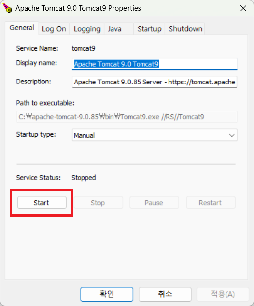
+
8. 웹 브라우저를 실행하고 아래 주소를 입력하고 이동하여 tomcat 설치를 확인합니다.
+
locahost:8080
+
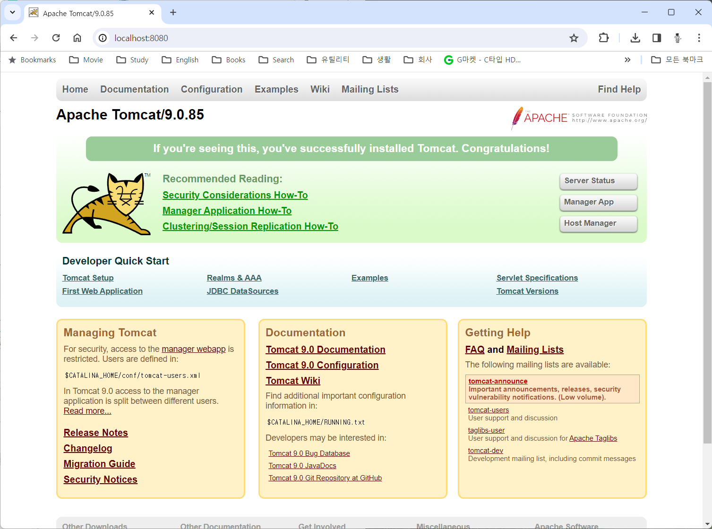

=== macOS에서 Tomcat 설치

1. 터미널을 실행합니다.
2. 아래 명령을 실행하여 homebrew를 업데이트 합니다.
+
----
$ brew update
----
+
3. 아래 명령을 실행하여 tomcat 9 버전을 설치합니다.
+
----
$ brew install tomcat@9
----
+
4. 아래 명령을 실행하여 설치된 tomcat 정보를 확인합니다.
+
----
$ brew info tomcat@9
==> tomcat@9: stable 9.0.85 (bottled) [keg-only]
Implementation of Java Servlet and JavaServer Pages
https://tomcat.apache.org/
/opt/homebrew/Cellar/tomcat@9/9.0.85 (632 files, 15.7MB)
  Poured from bottle using the formulae.brew.sh API on 2024-02-02 at 14:05:58
From: https://github.com/Homebrew/homebrew-core/blob/HEAD/Formula/t/tomcat@9.rb
License: Apache-2.0
==> Dependencies
Required: openjdk ✔
==> Caveats
Configuration files: /opt/homebrew/etc/tomcat@9

tomcat@9 is keg-only, which means it was not symlinked into /opt/homebrew,
because this is an alternate version of another formula.

If you need to have tomcat@9 first in your PATH, run:
  echo 'export PATH="/opt/homebrew/opt/tomcat@9/bin:$PATH"' >> ~/.zshrc

To start tomcat@9 now and restart at login:
  brew services start tomcat@9
Or, if you don't want/need a background service you can just run:
  /opt/homebrew/opt/tomcat@9/bin/catalina run
==> Analytics
install: 978 (30 days), 2,743 (90 days), 9,730 (365 days)
install-on-request: 978 (30 days), 2,743 (90 days), 9,730 (365 days)
build-error: 0 (30 days)
----
+
5. 아래 명령을 실행하여 설치된 tomcat 디렉토리를 확인합니다.
+
----
% ls -l /opt/homebrew/etc/tomcat@9
total 464
-rw-------  1 gikpreet  admin   12953  2  2 14:05 catalina.policy
-rw-------  1 gikpreet  admin    7630  2  2 14:05 catalina.properties
-rw-------  1 gikpreet  admin    1400  2  2 14:05 context.xml
-rw-------  1 gikpreet  admin    1149  2  2 14:05 jaspic-providers.xml
-rw-------  1 gikpreet  admin    2313  2  2 14:05 jaspic-providers.xsd
-rw-------  1 gikpreet  admin    4144  2  2 14:05 logging.properties
-rw-------  1 gikpreet  admin    7856  2  2 14:05 server.xml
-rw-------  1 gikpreet  admin    2756  2  2 14:05 tomcat-users.xml
-rw-------  1 gikpreet  admin    2558  2  2 14:05 tomcat-users.xsd
-rw-------  1 gikpreet  admin  172951  2  2 14:05 web.xml
----
+
6. 아래 명령을 실행하여 tomcat을 실행합니다.
+
----
$ brew service start tomcat@9
==> Successfully started `tomcat@9` (label: homebrew.mxcl.tomcat@9)
----
+
7. 웹 브라우저를 실행하고 주소창에 아래 주소를 입력하고 이동하여 tomcat의 동작을 확인합니다.
+
http://localhost:8080
+
image:./images/image29.png[]

=== Linux(Ububtu)애서 tomcat 설치

== Visual Studio Code에서 tomcat 설정

이 연습에서는 Visual Studio Code에서 tomcat을 관리할 수 있도록 설정합니다. 아래 절차에 따릅니다.

1. Visual Studio Code를 실행합니다.
2. 왼쪽에서 **Extension(확장)**을 클릭하고 **Community Server Connectors**를 검색하여 설치합니다.
+

+
3. 왼쪽의 Explorer창의 아래쪽에서 Server 패널을 확장합니다.
4. Servers 패널의 오른쪽 위에서 **Create New Server...** 버튼을 클릭합니다.
+
image:./images/image34.png[]
+
5. Command Parett에서 **No, user server on disk**를 클릭합니다.
+
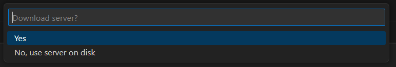
+
6. **폴더 선택** 창에서 tomcat을 설치한 c:\apache-tomcat-<version number> 폴터를 선택하고 **Select desired server location** 버튼을 클릭합니다.
7. Server 설정 탭에서 **Server Name**에 tomcat의 버전을 입력하고 **Finish** 버튼을 클릭합니다.
+
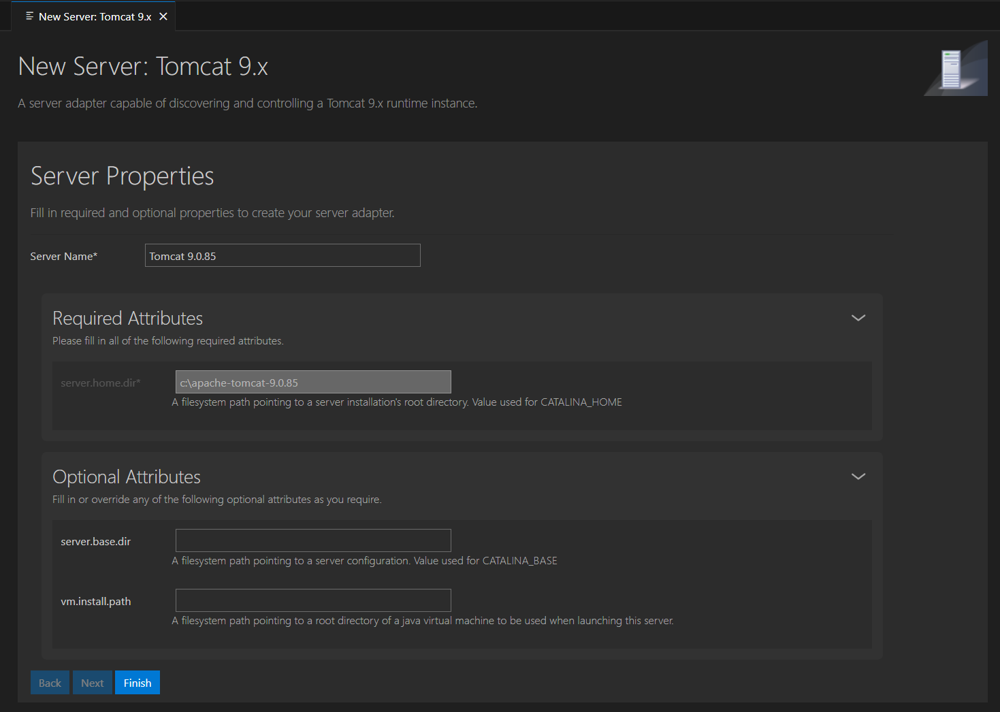
+
8. 등록된 tomcat을 확인합니다.
+
image:./images/image37.png[]

== Visual Studio Code에서 Servlet 프로그램 개발

=== 프로젝트 생성

1. Visual Studio Code를 실행합니다.
2. **View(보기)** 메뉴에서 **Command Paratte(명령 팔레트)**를 클릭합니다.
3. Create Java Project.. 를 클릭합니다.
+
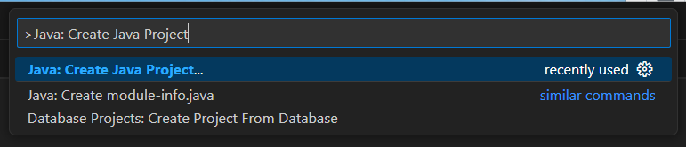
+
4. **Select the project type**에서 **Maven**을 선택합니다.
+
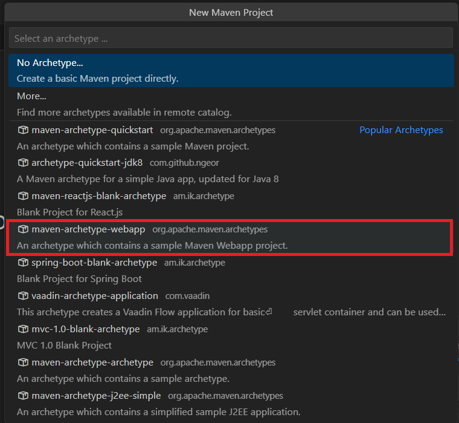
+
5. **Select the Archetype**에서 **maven-archetype-webapp**을 선택합니다.
+
image:./images/image17.png[]
+
6. **Select version if maven-archetype-webapp**에서 1.4를 선택합니다.
+
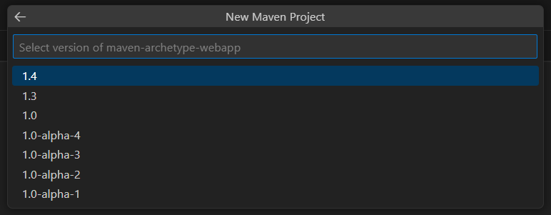
+
7. **New Maven Project**에서 com.nhnacademy를 입력하고 Enter키를 누릅니다.
+
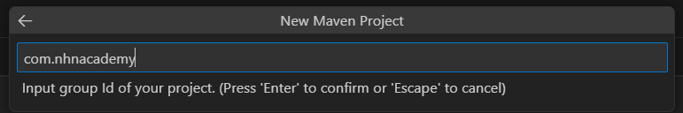
+
8. **New Maven Project**에서 **firstservlet**를 입력하고 Enter키를 누릅니다.
+
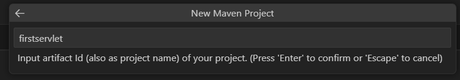
+
9. 폴더 선택 대화상자에서 프로젝트가 위치할 폴더를 선택하고 **Select Destination Folder** 버튼을 클릭합니다.
10. 프로젝트가 생성되는 도중, Visual Studio 터미널창에서 **Define value for property 'version' 1.0-SNAPSHOT:** 에서 Enter 키를 누릅니다.
11. **Y: :** 에서 Enter 키를 누릅니다.
12. 프로젝트 생성이 완료되면, 오른쪽 아래 프로젝트 정보 창에서 **Open** 버튼을 클릭합니다.
+
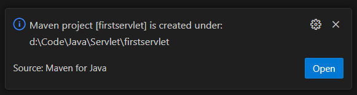

== 의존성 작성

1. Explorer에서 pom.xml 파일을 클릭해서 엽니다.
+
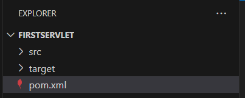
+
2. pom.xml 파일의 dependency 요소에 **jakarta.servlet-api** 의존성을 추가합니다.
+
[source, xml]
----
   <dependency>
      <groupId>jakarta.servlet</groupId>
      <artifactId>jakarta.servlet-api</artifactId>
      <version>4.0.4</version>
      <scope>provided</scope>
  </dependency>
----
