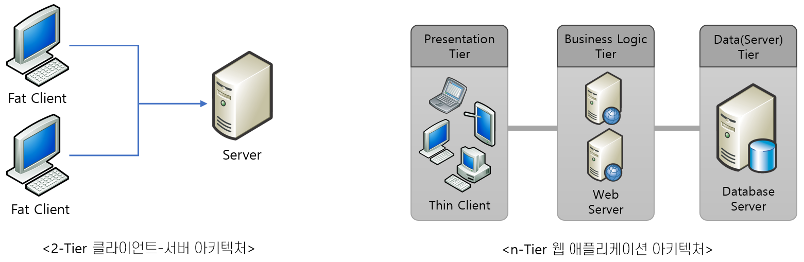

=  Web Application 아키텍처

* Client-Server에 비해 향상된 아키텍처
** 2-Tier로 구성된 Client-Server에 비해 n-Tier 아키텍처를 기본으로 함
** 여러 계층(Tier, Layer)으로 구성되어 각 계층에서 필요한 구성요소를 구분하여 포함
* 향상된 아키텍처
** 2-Tier 클라이언트-서버에 비해 비즈니스 로직과 프리젠테이션을 분리한 구조
** 씬 클라이언트(Thin Client)를 사용하여 클라이언트의 성능에 문제를 일으키지 않음
** 프로그램의 변경과 유지보수가 쉬움

---

2-Tier 클라이언트-서버 형태는 가장 간단한 분산 컴퓨팅 형태로서, 구성이 간단하고 프로그램 개발이 쉽기 때문에 지금도 많이 사용되고 있습니다. 클라이언트-서버가 발전하여 Fat Client와 Fat Server라고 흔히들 부르는 많은 코드를 포함하는 서버와 클라이언트 형태가 되었는데, Fat Client는 GUI를 위한 코드 이외에도 비즈니르 로직 코드를 모두 가지고 있는 형태가 됩니다. 이 경우 배포와 유지 보수에 많은 어려움이 따릅니다. 그리고 클라이언트 프로그램은 Power Builder, Visual Basic등의 4GL언어를 사용해서 개발되어 포팅의 어려움도 있습니다.

Web Application은 이런 문제점을 해결하기 위한 아키텍처를 가지고 있습니다. Web Application에서 클라이언트로 사용되는 Chrome, Edge, Firefox등의 웹 브라우저는 HTML을 해석하는 기능과 다른 일부 기능만을 가진 Thin Client이므로 클라이언트 컴퓨터의 성능에 문제를 일으키지 않습니다. 또한 웹 응용 프로그램은 3-Tier 또는 n-Tier 아키텍처 형태이므로 비즈니스 로직과 프리젠테이션이 완전히 분리되어 있어 프로그램의 변경 및 유지 보수가 쉽습니다. 웹 응용 프로그램은 다양한 형태가 있을 수 있으나 3-Tier 형태를 기본 구조로 하고 있어 각 Tier의 성능 유지와 유지 보수에 유리한 구조로 작성할 수 있습니다.

link:./02_overview_web_application.adoc[이전: Web Application 개요] +
link:./04_web_application_components.adoc[다음: Web Application 구성요소]