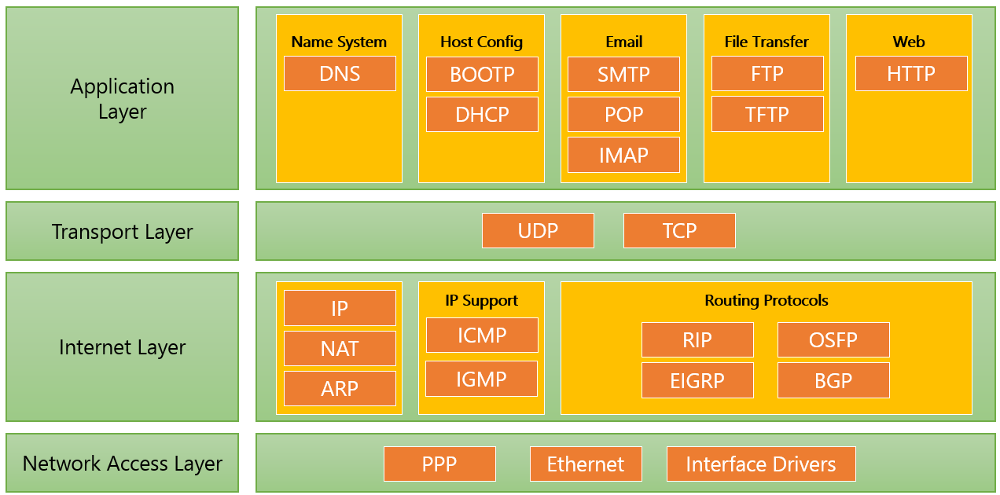

= Web Server 개요

* Web Server는 하드웨어, 소프트웨어 두 가지 측면에서의 의미
** **하드웨어** Web Server의 소프트웨어와 website의 컴포넌트 파일을 저장하는 컴퓨터
** **소프트웨어** 웹 사용자가 어떻게 호스트 파일에 접근하는지 관리
*** HTTP서버로 국한하면, HTTP 또는 HTTPS를 통해 웹 브라우저 또는 프로그램에서 요청에 응답하여 요청 결과를 전송하는 서비스 프로그램
*** URL과 HTTP의 소프트웨어의 일부
** 요청 프로그램(웹 브라우저, 다른 서비스 등)의 요청에 대한 응답을 전송
* 응답 유형
** HTML document
** 이미지, 파일
** HTTP 상태 코드
** 요청 결과(JSON, XML 등)

---

Web Server는 아래와 같이 두 가지 측면에서 생각할 수 있습니다.

1. 하드웨어 측면에서, 웹 서버는 웹 서버의 소프트웨어와 웹 사이트의 컴포넌트 파일을 저장하는 컴퓨터를 의미합니다. 컴포넌트 파일에는 HTML 문서, CSS stylesheet, JavaScript 파일들이 있습니다. 웹 서버는 인터넷에 연결되어 웹에 연결된 다른 기기들이 웹 서버의 데이터(컴포넌트 파일들)을 주고 받을 수 있도록 합니다.
2. 소프트웨어 측면에서, 웹 서버는 기본적으로 웹 사용자가 어떻게 호스트 파일에 접근하는지를 관리합니다. HTTP 서버로 국한하면, HTTP Server는 URL(Web address)과 HTTP의 소프트웨어의 일부입니다.

이 과정에서는 소프트웨어 측면에서의 웹 서버를 다룹니다.

웹 서버는 HTTP 또는 HTTPS 요청에 주로 응답하며, TCP/IP 계층 구조의 가장 위쪽 계층인 Application Layer에 존재합니다.

가장 기본적인 단계를 생각하면 웹 브라우저가 웹 서버에 있는 파일을 HTTP를 통해 파일을 요청합니다. 요청이 웹 서버에 도달하면 HTTP 서버는 요청된 문서는 HTTP를 통해 응답을 전달합니다.

link:./06_web_server.adoc[이전: Web Server] +
link:./08_web_server_functions.adoc[다음: Web Server의 기능]