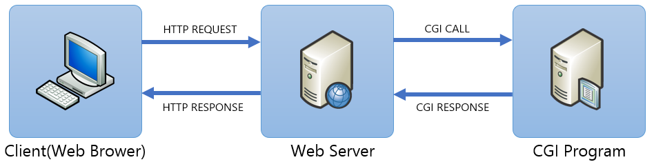

= CGI(Common Gateway Interface) 개요

* 서버와 애플리케이션간에 데이터를 주고 받는 방벙에 대한 명세
* 웹 서버가 **외부 프로그램**을 실행할 수 있도록 해 주는 인터페이스 명세(specification)
** 웹 서버 외부에 존재하는 CGI 프로그램이 동적 웹 콘텐츠를 생산

* 환경 변수나 표준 입출력을 다룰 수 있는 언어라면 어떤 언어든지 확장하여 사용가능
* 실행 속도나 텍스트 처리의 용이함 등을 이유로 perl, python, ruby등의 스크립트 언어가 주로 사용됨

---

CGI(Common Gateway Interface - 공용 게이트웨이 인터페이스)는 웹 서버 상에서 사용자 프로그램을 동작시키기 위한 조합을 말합니다. Apache, Nginx, IIS 등 많은 웹 서버 프로그램은 CGI 기능을 사용할 수 있습니다.

웹 서버 프로그램의 기능은 준비된 정보를 클라이언트의 요청에 응답으로 전송하는 것입니다. 정적인 컨텐츠를 제공하는 웹 서버는 정보를 웹 서버에서 동적으로 생성하고 클라이언트로 송신될 조합을 만들어내는 것이 불가능했습니다. 따라서 서버 프로그램에서 다른 프로그램을 불러내고, 그 처리 결과를 클라이언트에 송신하는 방법이 개발되었습니다. 이를 구현하기 위한 서버 프로그램과 외부 프로그램과의 연결 방법을 정한것이 CGI 입니다.

CGI는 환경 변수나 표준 입출력을 다룰 수 있는 프로그래밍 언어라면 확장하여 사용하는 것이 가능합니다. 다만, CGI는 어디까지나 인터페이스이며, 특정 플랫폼에 의존하지 않고 웹 서버 등으로부터 외부 프로그램을 호출하는 조합을 가리킵니다. 아래와 같은 방식이 사용됩니다.

* 컴파일 방식
** 기계어. 컴파일된 상태, C, C++
* 인터프리터 방식
** 스크립트 언어, ** ASP, PHP, Python, Perl
** 당 스크립트를 실행할 수 있는 스크립트 엔진 - 즉시 코드를 수정할 수 있음

CGI의 목적은 HTTP 서버가 URL에 지정된 프로그램과 인터페이스 할 수 있는 프레임워크를 제공함으로써 HTTP 서버의 기능을 확장하는 것입니다. URL의 형식은 매개변수를 CGI 프로그램으로 전달할 수 있도록 합니다. 서버 측에서, 인터페이스는 HTTP 서버에 의해 프로그램이 시작되는 방법과 프로그램에 대한 매개변수가 표준 입력 및 환경 변수의 조합을 사용하여 전달되는 방법을 설명합니다. 또한 출력 정보(예: HTML 요소)가 표준 출력을 사용하여 HTTP 서버로 다시 전달되는 방법을 설명합니다. 따라서, 가장 단순한 형태에서 CGI 프로그램은 다음과 같은 프로그램으로서 정의될 수 있습니다.

1. 실행 프로그램으로 호출되어 HTTP 서버의 하위 프로세스로 실행될 수 있다
2. 표준 입력에서 읽을 수 있다
3. 환경 변수에 액세스 할 수 있다
4. 표준 출력에 쓸 수 있다
5. 프로그램에 전달된 명령행 인수에 액세스 할 수 있다

link:./12_cgi.adoc[이전: CGI (Common Gateway Inteface)] +
link:./14_cgi_spec.adoc[다음: CGI Specification]