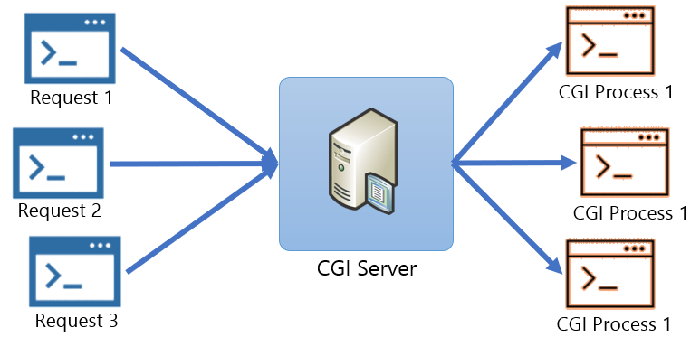

= CGI 장/단점

* 장점
** 언어, 플랫폼에 독립적
** 구조가 단순하고 다른 서버 사이드 프로그래밍 언어에 비해 쉽게 수행
* 단점
** 속도가 느림
*** 매 요청마다 DB Connection을 새로 열어야 합니다.
** Http 요청마다 새로운 프로세스를 만들어 서버 메모리를 사용합니다.
** 데이터가 메모리에 캐시 될 수 없다.

---

link:./14_cgi_spec[이전: CGI Specification] +
link:./16_lab2-2.adoc[다음: Lab 2-2 Apache 기반 간단한 CGI 프로그램 작성]
