= Lab 2-2 Apache 기반 간단한 CGI 프로그램 작성

이 연습에서는 Apache 웹 서버상에서 동작하는 간단한 CGI 프로그램을 작성합니다.

== Windows에서 간단한 CGI 프로그램 작성

이 연습에서는 Windows에서 간단한 CGI 프로그램을 작성하는 것을 연습합니다.

=== 환경 확인

1. 명령 프롬프트에서 아래 명령을 실행하여 Nginx의 상태를 확인합니다.
+
----
> tasklist /fi "imagename eq nginx.exe"
----
+
2. nginx 프로세스가 발견되면, Nginx가 실행중임을 의미합니다.
+
----
> tasklist /fi "imagename eq nginx.exe"

이미지 이름                    PID 세션 이름              세션#  메모리 사용
========================= ======== ================ =========== ============
nginx.exe                    24872 Console                    2      8,788 K
nginx.exe                     4828 Console                    2      9,136 K
----
+
3. 실행중이면, 아래 명령을 실행하여 Nginx를 종료합니다.
+ 
----
> nginx -s quit
> tasklist /fi "imagename eq nginx.exe"
정보: 실행 중인 작업 중 지정된 조건에 일치하는 작업이 없습니다.
----

=== Apache 설치

1. 웹 브라우저를 실행하고 아래 웹 사이트로 이동합니다.
+
----
https://dlcdn.apache.org/httpd/binaries/win32/
----
+
2. 아래 **Downloading Apache for Windows** 구역에서 **ApacheHaus**를 클릭합니다.
+
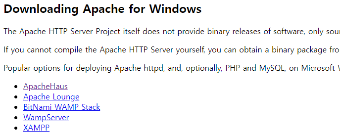
+
3. Apache Haus 웹 사이트에서 64비트 Binary Apache를 다운로드 합니다.
+
image:../images/image53.png[]
+
4. 다운로드 폴더에서 압축을 해제합니다.
5. 압축이 해제 되면, 압축을 해제한 폴더의 Apache24 폴더를 C 드라이브 루트로 복사합니다.
6. 복사된 폴더(c:\Apache24)의 conf 폴더에서, httpd.conf 파일을 편집기에서 엽니다.
7. Define SRVROOT 항목을 찾아, Apache를 설치한 폴더(c:\Apache24)로 변경합니다.
+
----
Define SRVROOT "c:\Apache24"
ServerRoot "${SRVROOT}"
----
+
8. c:\Apache24\bin 폴더에서 ApacheMonitor.exe를 더블클릭하여 실행합니다.
9. 윈도우 오른쪽 하단의 시스템 트레이에서 ApacheMonitor가 동작중인것을 확인합니다.
+
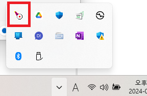
+
10. 시스템 트레이에서 ApacheMonitor를 마우스 오른쪽 클릭하고 **Open Apache Monitor**를 클릭합니다.
+
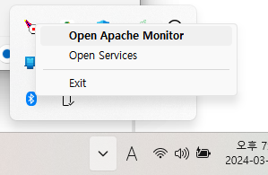
+
11. Apache Service Monitor가 실행되면 Start 버튼을 클릭하여 Apache 서비스를 시작합니다.
+
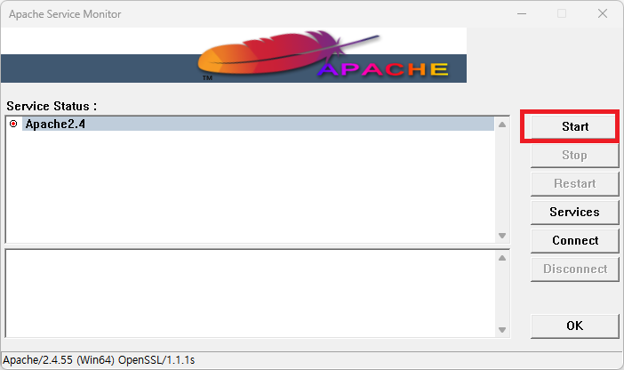
+
12. 웹 브라우저를 실행하고 주소창에 http://localhost/ 를 입력하고 이동하여 Apache 웹 서버의 실행을 확인합니다.
+
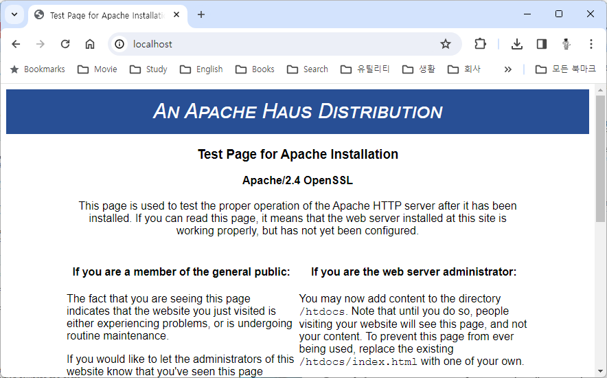

=== 환경 구성

1. c:\Apache24\conf\httpd.conf 파일을 편집기에서 열고 내용을 확인합니다..
a. 기본 문서 디렉토리가 **DocumentRoot "${SRVROOT}/htdocs"**(여기서는 c:\apache24\htdocs) 인 것을 확인합니다.
+
----
DocumentRoot "${SRVROOT}/htdocs"
----
+
b. 오류 로그의 위치를 확인합니다.
+
----
ErrorLog "logs/error.log"
----
+
c. CGI 디렉토리를 확인합니다. 여기서는 c:\apache24\cgi-bin 폴더입니다.
+
----
<Directory "${SRVROOT}/cgi-bin">
    AllowOverride None
    Options None
    Require all granted
</Directory>
----
+
2. **<Directory "${SRVROOT}/cgi-bin">** 요소를 찾아 아래와 같이 수정합니다.
+
[source, xml]
----
<Directory "${SRVROOT}/cgi-bin">
    AllowOverride None
    Options +ExecCGI
    AddHandler cgi-script .pl .py .cgi
    Require all granted
</Directory>
----
+
3. 파일을 저장합니다.

=== CGI 프로그램 작성

==== Python을 이용한 CGI 프로그램 작성

1. c:\apache2\cgi-bin 폴더에 cgi-python.py 파일을 생성합니다.
2. 생성한 cgi-python.py 파일을 아래와 같이 작성합니다.
+
[source, python]
----
#!C:\Users\gik_k\anaconda3\python.exe

import cgi;
import cgitb;cgitb.enable()

print("Content-Type: text/html\n\r\n")
print("<h2>Hello, CGI with Python</h2>")
----
+
3. 웹 브라우저를 실행하고 주소창에 http://localhost/cgi-bin/cgi-python.py 를 입력하고 이동하여 Apache 웹 서버의 실행을 확인합니다.
+
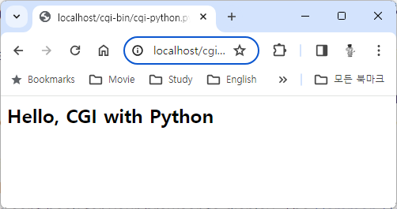

==== C 언어를 이용한 CGI 프로그램 작성

1. c:\apache2\cgi-bin 폴더에 cgi-c.c 파일을 생성합니다.
2. 생성한 cgi-c.c 파일을 아래와 같이 작성합니다.
+
[source, c]
----
#include <stdio.h>

int main() {
    printf("Content-Type: text/html\n\r\n");
    printf("<h2>Hello, CGI with C language</h2>");
}
----
+
3. 명령 프롬프트에서, c:\apache2\cgi-bin로 이동하고 아래 명령을 실행하여 컴파일합니다.
+
----
> gcc cgi-c.c -o cgi-c.cgi
----
+
4. 웹 브라우저를 실행하고 주소창에 http://localhost/cgi-bin/cgi-c.cgi 를 입력하고 이동하여 Apache 웹 서버의 실행을 확인합니다.
+
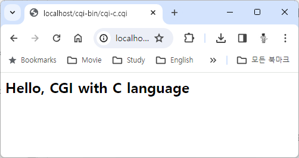

== macOS에서 간단한 CGI 프로그램 작성

이 연습에서는 macOS에서 간단한 CGI 프로그램을 작성하는 것을 연습합니다.

=== 환경 확인

1. 아래 명령을 실행하여 Nginx가 실행중인지 확인합니다.
+
----
% ps -ef | grep nginx
----
+
2. nginx 워커 프로세스가 발견되면, Nginx가 실행중임을 의미합니다.
+
----
% ps -ef | grep nginx
    0 64921     1   0  6:37PM ??         0:00.03 nginx: master process /opt/homebrew/opt/nginx/bin/nginx -g daemon off;  
   -2 64924 64921   0  6:37PM ??         0:00.00 nginx: worker process  
  502 65055 71819   0  6:38PM ttys000    0:00.00 grep nginx
----
+
3. 실행중이면, 아래 명령을 실행하여 Nginx를 종료합니다.
+
----
% sudo brew services stop nginx
----

macOS에는 기본적으로 Apache가 설치되어 있습니다. 확인을 위해 아래 절차에 따릅니다.

1. 터미널을 실행하고 아래 명령을 실행하여 설치된 Apache의 버전을 확인합니다.
+
----
% apachectl -v
Server version: Apache/2.4.56 (Unix)
Server built:   Nov 12 2023 00:47:49
----
+
2. 아래 명령을 실행하여 Apache를 시작합니다.
+
----
% sudo apachectl start
----
+
3. 웹 브라우저를 실행하고 주소창에 http://localhost/ 를 입력하고 이동하여 Apache 웹 서버의 실행을 확인합니다.
+
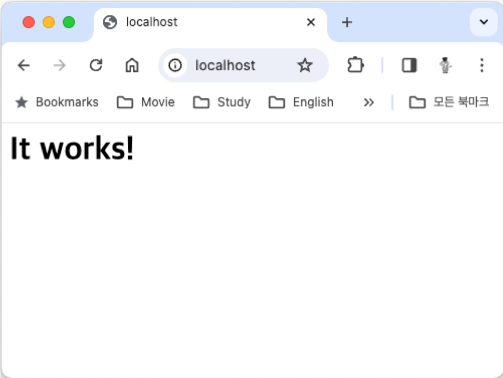

=== 환경 구성

1. /private/etc/apache2/httpd.conf 파일을 관리자 모드로 열고 내용을 확인합니다.
a. 기본 문서 디렉토리가 **/Library/WebServer/Documents** 인 것을 확인합니다.
+
----
DocumentRoot "/Library/WebServer/Documents"
<Directory "/Library/WebServer/Documents">
----
+
b. 오류 로그의 위치를 확인합니다.
+
----
ErrorLog "/private/var/log/apache2/error_log"
----
+
c. CGI 디렉토리를 확인합니다.
+
----
<Directory "/Library/WebServer/CGI-Executables">
    AllowOverride None
    Options None
    Require all granted
</Directory>
----
+
2. /private/etc/apache2/httpd.conf 파일에서 아래 라인을 찾아 주석을 해제합니다.
+
----
LoadModule cgid_module libexec/apache2/mod_cgid.so
LoadModule cgi_module libexec/apache2/mod_cgi.so
----
+
3. /private/etc/apache2/httpd.conf 파일에서 아래 라인을 찾아 주석을 해제합니다.
+
----
LoadModule perl_module libexec/apache2/mod_perl.so
----
+
4. **<Directory "/Library/WebServer/CGI-Executables">** 요소를 찾아 아래와 같이 수정합니다.
+
[source, xml]
----
<Directory "/Library/WebServer/CGI-Executables">
    AllowOverride None
    Options +ExecCGI 
    AddHandler cgi-script .pl .py .cgi .sh
    Require all granted
</Directory>
----
+
5. 파일을 저장합니다.

=== CGI 프로그램 작성

==== Bash를 이용한 CGI 프로그램 작성

1. 터미널에서 **/Library/WebServer/CGI-Executables** 디렉토리로 이동하고, 아래 명령을 실행하여 cgi-bash.sh 파일을 작성합니다.
+
----
% sudo touch cgi-bash.sh
----
+
2. 아래 명령을 수행하여 생성한 cgi-bash.sh 파일의 권한을 변경합니다.
+
----
% sudo chmod a+x cgi-bash.sh
----
+
3. 생성된 cgi-bash.sh 파일을 관리자 모드로 열고 아래와 같이 수정합니다.
+
[source, bash]
----
#!/bin/bash

echo "content-type: text/html\n\r\n"
echo ''
echo 'Hello, CGI!'
----
+
4. 웹 브라우저를 실행하고 주소창에 http://localhost/cgi-bin/cgi-bash.sh 를 입력하고 이동하여 Apache 웹 서버의 실행을 확인합니다.
+
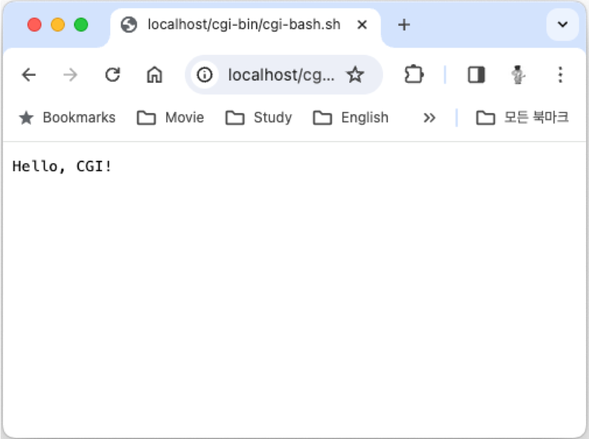

==== Python을 이용한 CGI 프로그램 작성

1. 터미널에서 **/Library/WebServer/CGI-Executables** 디렉토리로 이동하고, 아래 명령을 실행하여 cgi-python.py 파일을 작성합니다.
+
----
% sudo touch cgi-python.py
----
+
2. 아래 명령을 수행하여 생성한 cgi-python.py 파일의 권한을 변경합니다.
+
----
% sudo chmod a+x bash-cgi.sh
----
+
3. 생성된 cgi-python.sh 파일을 관리자 모드로 열고 아래와 같이 수정합니다.
+
[source, python]
----
#!/opt/anaconda3/bin/python

import cgi;
import cgitb;cgitb.enable()

print("Content-Type: text/html\n\r\n")
print("<h2>Hello, CGI with Python</h2>")
----
+
> 첫 줄의 Shebang 명령은 사용자의 python 프로그램이 존재하는 위치이어야 합니다.
+
4. 웹 브라우저를 실행하고 주소창에 http://localhost/cgi-bin/cgi-python.py 를 입력하고 이동하여 Apache 웹 서버의 실행을 확인합니다.
+
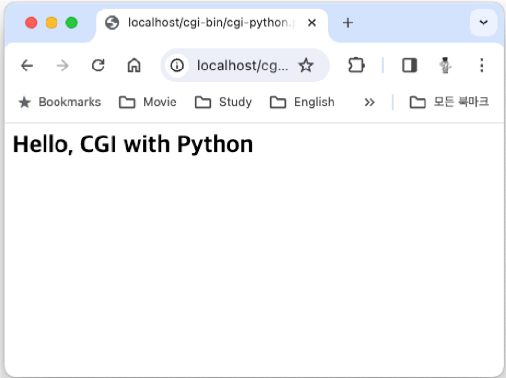

==== C 언어를 이용한 CGI 프로그램 작성

1. 터미널에서 **/Library/WebServer/CGI-Executables** 디렉토리로 이동하고, 아래 명령을 실행하여 cgi-c.c 파일을 작성합니다.
+
----
% sudo touch cgi-c.c
----
+
2. 아래 명령을 수행하여 생성한 cgi-c.c 파일의 권한을 변경합니다.
+
----
% sudo chmod 644 bash-cgi.sh
----
+
3. 생성된 cgi-c.c 파일을 관리자 모드로 열고 아래와 같이 수정합니다.
+
[source, c]
----
#include <stdio.h>

int main() {
    printf("Content-Type: text/html\n\r\n");
    printf("<h2>Hello, CGI with C language</h2>");
}
----
+
4. 터미널에서 아래 명령을 실행하여 작성한 cgi-c.c 파일을 cgi-c.cgi 로 컴파일합니다.
+
----
% sudo gcc cgi-c.c -o cgi-c.cgi
----
+
5. 웹 브라우저를 실행하고 주소창에 http://localhost/cgi-bin/cgi-c.cgi 를 입력하고 이동하여 Apache 웹 서버의 실행을 확인합니다.
+
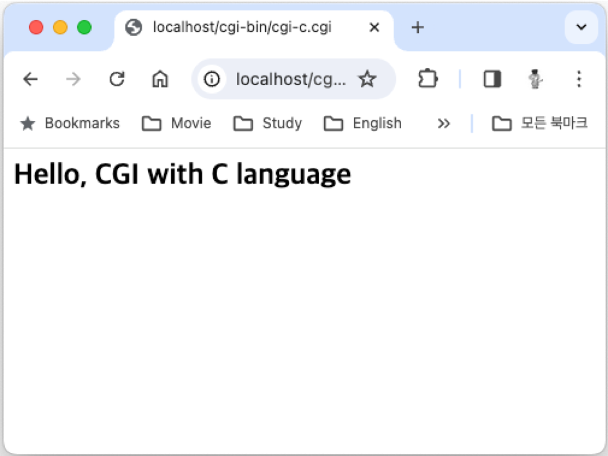

== Linux(Ubuntu)에서 간단한 CGI 프로그램 작성

이 연습에서는 Ubuntu Linux에서 간단한 CGI 프로그램을 작성하는 것을 연습합니다.

=== 환경 확인

1. 터미널을 실행합니다.
2. 아래 명령을 수행하여 nginx의 상태를 확인합니다.
+
----
$ sudo systemctl status nginx
● nginx.service - A high performance web server and a reverse proxy server
     Loaded: loaded (/lib/systemd/system/nginx.service; enabled; vendor preset: enabled)
     Active: inactive (dead) since Wed 2024-03-06 11:07:47 KST; 37s ago
       Docs: man:nginx(8)
    Process: 253382 ExecStop=/sbin/start-stop-daemon --quiet --stop --retry QUIT/5 --pidfile /run/nginx.pid (code=exited, status=2)
   Main PID: 252442 (code=exited, status=0/SUCCESS)

 3월 06 11:06:50 Rachel systemd[1]: Starting A high performance web server and a reverse proxy server...
 3월 06 11:06:50 Rachel systemd[1]: Started A high performance web server and a reverse proxy server.
 3월 06 11:07:42 Rachel systemd[1]: Stopping A high performance web server and a reverse proxy server...
 3월 06 11:07:47 Rachel systemd[1]: nginx.service: Succeeded.
 3월 06 11:07:47 Rachel systemd[1]: Stopped A high performance web server and a reverse proxy server.

----
+
3. 만약 Nginx가 inactive 상태가 아니라면, 아래 명령을 실행하여 Nginx를 종료합니다.
+
----
$ sudo systemctl stop nginx
----
+
4. 아래 명령을 실행하여 동작하고 있는 웹 서버가 없는지 확인합니다.
+
----
$ curl localhost
curl: (7) Failed to connect to localhost port 80 after 0 ms: Couldn't connect to server
----

=== Apache2 설치

1. 터미널에서 아래 명령을 실행하여 apt를 업데이트 합니다.
+
----
$ sudo apt update
----
+
2. 아래 명령을 실행하여 Apache 웹 서버를 설치합니다.
+
----
$ sudo apt install apache2
----
+
3. 아래 명령을 실행하여 Apache 웹 서버의 상태를 확인합니다.
+
----
$ sudo systemctl status apache2
● apache2.service - The Apache HTTP Server
     Loaded: loaded (/lib/systemd/system/apache2.service; enabled; vendor preset: enabled)
     Active: active (running) since Wed 2024-03-06 11:20:03 KST; 59s ago
       Docs: https://httpd.apache.org/docs/2.4/
   Main PID: 275507 (apache2)
      Tasks: 55 (limit: 18615)
     Memory: 5.0M
     CGroup: /system.slice/apache2.service
             ├─275507 /usr/sbin/apache2 -k start
             ├─275508 /usr/sbin/apache2 -k start
             └─275509 /usr/sbin/apache2 -k start

 3월 06 11:20:03 Rachel systemd[1]: Starting The Apache HTTP Server...
 3월 06 11:20:03 Rachel apachectl[275506]: AH00558: apache2: Could not reliably determine the server's fully qualified domain name, using 1>
 3월 06 11:20:03 Rachel systemd[1]: Started The Apache HTTP Server.
----
+
4. 웹 브라우저를 실행하고 주소창에 http://localhost를 입력하고 이동하여 Apache 웹 서버의 실행을 확인합니다.
+
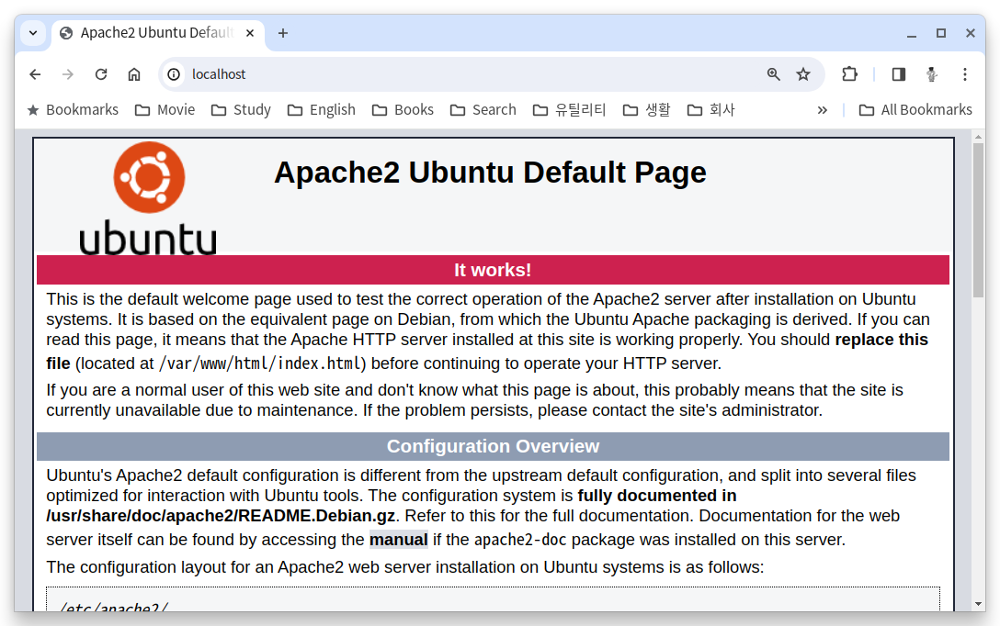

=== 환경 구성

1. 아래 명령을 실행하여 /var/www 아래에 cgi-bin 디렉토리를 생성합니다.
+
----
$ sudo mkdir /var/www/cgi-bin
----
+
2. /etc/apache2/apache2.conf 파일을 열고 제일 아래에 아래 코드를 작성한 후 저장합니다.
+
----
# Adding capaility to run CGI-scripts 
ServerName localhost
ScriptAlias /cgi-bin/ /var/www/cgi-bin/
Options +ExecCGI
AddHandler cgi-script .cgi .pl .py .sh

# vim: syntax=apache ts=4 sw=4 sts=4 sr noet
----
+
3. /etc/apache2/conf-available/serve-cgi-bin.conf 파일을 열고 <IfDefine ENABLE_USR_LIB_CGI_BIN> 요소의 값을 아래와 같이 변경한 후 저장합니다.
+
[source, xml]
----
<IfDefine ENABLE_USR_LIB_CGI_BIN>
	ScriptAlias /cgi-bin/ /var/www/cgi-bin/
	<Directory "/var/www/cgi-bin">
		AllowOverride None
		Options +ExecCGI
	</Directory>
</IfDefine>
----
+
4. 터미널에서 아래 명령을 실행하여 cgi를 활성화합니다.
+
----
$ sudo a2enmod cgid
----
+
5. 터미널에서 아래 명령을 실행하여 Apache 웹 서버를 다시 시작합니다.
+
----
$ sudo systemctl restart apache2
----

=== CGI 프로그램 작성

==== Bash를 이용한 CGI 프로그램 작성

1. 터미널에서 /var/www/cgi-bin 디렉토리로 이동하고, 아래 명령을 실행하여 cgi-bash.sh 파일을 생성합니다.
+
----
$ sudo touch cgi-bash.sh
----
+
2. 아래 명령을 수행하여 생성한 cgi-bash.sh 파일의 권한을 변경합니다.
+
----
$ sudo chmod o+x cgi-bash.sh
----
+
3. 생성된 cgi-bash.sh 파일을 열고 아래와 같이 수정합니다.
+
[source, bash]
----
#!/bin/bash

echo "content-type: text/html\n\r\n"
echo ''
echo 'Hello, CGI!'
----
+
4. 웹 브라우저를 실행하고 주소창에 http://localhost/cgi-bin/cgi-bash.sh를 입력하고 이동하여 Apache 웹 서버의 실행을 확인합니다.
+
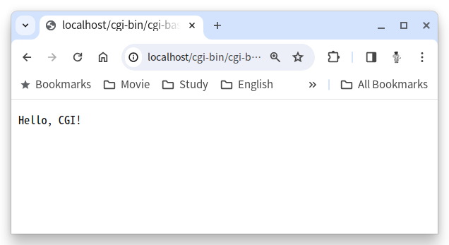
+
> 오류가 발생할 경우, /var/log/apache2/error.log 파일을 이용하여 오류 내용을 검색한 후, 수정합니다.

==== Python을 이용한 CGI 프로그램 작성

1. 터미널에서 터미널에서 /var/www/cgi-bin 디렉토리로 이동하고, 아래 명령을 실행하여 cgi-python.py 파일을 생성합니다.
+
----
$ sudo touch cgi-python.py
----
+
2. 아래 명령을 수행하여 생성한 cgi-python.py 파일의 권한을 변경합니다.
+
----
$ sudo chmod o+x cgi-python.py
----
+
3. 생성된 cgi-python.py 파일을 아래와 같이 수정합니다.
+
[source, python]
----
#!/usr/bin/python3

import cgi;
import cgitb;cgitb.enable()

print("Content-Type: text/html\n\r\n")
print("<h2>Hello, CGI with Python</h2>")
----
+
4. 웹 브라우저를 실행하고 주소창에 http://localhost/cgi-bin/cgi-python.py를 입력하고 이동하여 Apache 웹 서버의 실행을 확인합니다.
+
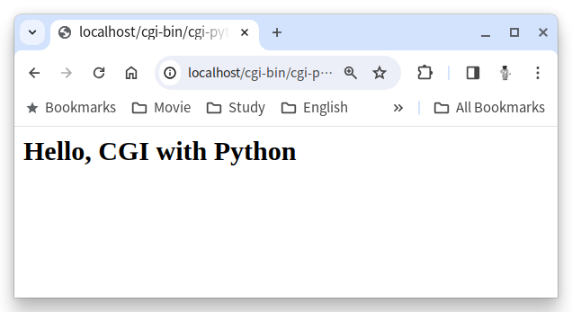

==== C 언어를 사용한 CGI 프로그램 작성

1. 터미널에서 /var/www/cgi-bin 디렉토리로 이동하고, 아래 명령을 실행하여 cgi-c.c 파일을 생성합니다.
+
----
$ sudo touch cgi-c.c
----
+
2. 아래 명령을 수행하여 생성한 cgi-c.c 파일의 권한을 변경합니다.
+
----
$ sudo chmod 644 cgi-c.c
----
+
3. 생성한 cgi-c.c 파일을 편집기에서 아래와 같이 수정합니다.
+
[source, c]
----
#include <stdio.h>

int main() {
    printf("Content-Type: text/html\n\r\n");
    printf("<h2>Hello, CGI with C language</h2>");
}
----
+
4. 터미널에서 아래 명령을 실행하여 작성한 cgi-c.c 파일을 cgi-c.cgi 로 컴파일합니다.
+
----
$ sudo gcc cgi-c.c -o cgi-c.cgi
----
+
5. 아래 명령을 실행하여 생성된 파일을 확인합니다.
+
----
$ ls -al
/var/www/cgi-bin$ ls -al
total 56
drwxr-xr-x 2 root root  4096  3월  6 14:27 .
drwxr-xr-x 5 root root  4096  3월  6 09:09 ..
-rw-r--r-x 1 root root    76  3월  6 14:18 cgi-bash.sh
-rw-r--r-- 1 root root   130  3월  6 14:17 cgi-c.c
-rwxr-xr-x 1 root root 16744  3월  6 14:27 cgi-c.cgi
-rwxr-xr-x 1 root root   141  3월  6 14:18 cgi-python.py
----
+
6. 웹 브라우저를 실행하고 주소창에 http://localhost/cgi-bin/cgi-c.cgi 를 입력하고 이동하여 Apache 웹 서버의 실행을 확인합니다.
+
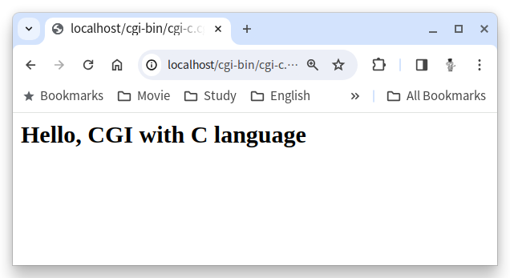

[cols="1a"]
|===
|**참고** 만약 실행이 안될 경우, 아래 절차를 따르십시오. +
1. 편집기에서 /etc/apache2/sites-available/000-default.conf 파일을 엽니다. +
2. DocumentRoot /var/www/html 아래에 아래 요소들을 삽입합니다. +
[source, xml]
----
<Directory / >
  Options FollowSymLinks
  AllowOverride None
</Directory>

<Directory /var/www/ >
  Options Indexes FollowSymLinks MultiViews
  AllowOverride None
  Order allow,deny
  Allow from all
</Directory>

<Directory /var/www/cgi-bin/ >
  AllowOverride None
  Options _ExecGCI -MultiViews +SymLinksIfOwnerMatch
  AddHandler cgi-script .cgi .pl .py .sh
  Order allow,deny
  Allow from all
</Directory>
---- 
+
3. 파일을 저장하고, 터미널에서 아래 명령을 실행하여 Apache를 재시작 합니다.
----
$ sudo systemctl restart apache2
----
|===

link:./15_cgi_pros_cons.adoc[이전: CGI 장단점] +
link:./17_java_cgi_program.adoc[다음: Java CGI 프로그램]