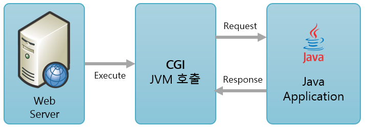

= Java CGI Program

* .class 형태로 컴파일된 Java는 CGI 방식으로 동작할 수 없음
** JVM은 Java Program을 실행할 수는 있음
** 웹 서버와 Java 애플리케이션을 실행하는 서버는 통신할 수 없음
+
image:../images/image10.png[]
+
** 웹 서버와 Java Application 사이의 게이트웨이(JCGI)가 필요
+
image:../images/image11.png[]

* 문제점
** 별도의 스크립트가 필요
*** jcgi
*** Java 런타임 인터프리터 필요
*** Main 클래스 지정
** 환경 변수를 명시적으로 Java 프로그램에 넘겨줘야 함
*** java -jar /some/path/javacgi.jar
*** java -jar -Dcgi.request_method=$REQUEST_METHOD /some/path/javacgi.jar

---

Java의 동작 방식을 살펴보면, Java 컴파일러(javac)는 Java 프로그래밍 언어로 작성된 코드를 바이트 코드로 컴파일하고, 컴파일된 .class 형식 바이크코드를 Java Virtual Machine이 실행합니다.

동적 웹 컨텐츠를 생산하기 위해 Java를 사용하고자 할 경우, 컴파일된 바이트코드의 실행을 위해서는 Java Virtual Machine이 필요합니다. 여기서 문제는 Java Virtual Machine은 CGI Specification을 직접적으로 따르지 않아, Web Server와 직접적으로 통신할 수 없습니다.

Java로 동적 웹 컨텐츠를 생산하여 웹 서버로 전송하기 위해서는 Java를 위해 특별히 제작된 CGI 프로그램이 필요합니다. 이를 위해 Java CGI를 사용할 수 있고, 여러 단점이 존재하는 이런 형태의 CGI를 대체하여 만들어진 Java Servlet을 사용할 수 있습니다. 여기서는 Java CGI를 먼저 다룹니다.

== Java CGI 동작

Java로 만들어진 프로그램을 실행하려면 Java Virtual Machine이 필요합니다. 일반적으로 웹 서버는 Java Virtual Machine을 직접적으로 실행하지 못합니다. 따라서, Java Virtual Machine을 실행시켜 줄 CGI 프로그램이 필요합니다. 이를 위해 shell script등을 사용할 수 있습니다.

Java 애플리케이션이 아래와 같다고 할 때,

[source, java]
----
public class CgiMain {
    public static void main(String[] args) {
        System.out.println("Content-type: text/plain");
        System.out.println();

        System.getProperties().forEach((k, v) -> {
            System.out.println(k + "=" + v);
        });
    }
}
----

Web Server의 CGI에는 아래와 같이 Java Virtual Machine을 실행할 수 있는 CGI 응용 프로그램이 필요하며, 환경 변수를 명시적으로 Java 프로그램에 넘겨줘야 합니다.

[source, bash]
----
#!/bin/bash
#printf "Content-type: text/plain\n\n"
#printf "REQUEST_METHOD=$REQUEST_METHOD\n"

java -jar /some/path/javacgi.jar
----

또한 CGI 프로그램은 Java의 Application의 Application Entry Point가 포함된 클래스를 지정해야 합니다.

link:./16_lab2-2.adoc[이전: Lab 2-2 Apache 기반 간단한 CGI 프로그램 작성] +
link:./18_lab2-3.adoc[다음: Lab 2-3 Java CGI 프로그램 작성]

