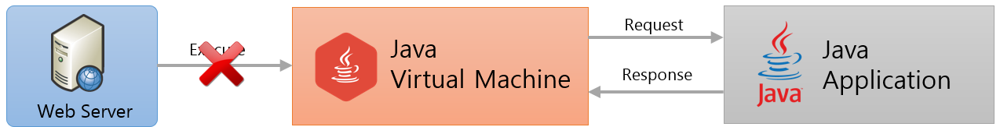
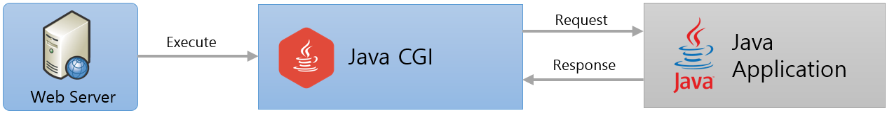

= Java CGI Program

* .class 형태로 컴파일된 Java는 CGI 방식으로 동작할 수 없음
** JVM은 Java Program을 실행할 수는 있음
** 웹 서버와 Java Application Server는 통신할 수 없음
+

+
** 웹 서버와 Java Application 사이의 게이트웨이(JCGI)가 필요
+

+

---

* JCGI
** Java로 작성한 프로그램을 구동하기 위한 CGI 프로그램

Java로 작성한 CGI 프로그램

[source, java]
----
public class CgiMain {
    public static void main(String[] args) {
        System.out.println("Content-type: text/plain");
        System.out.println();

        System.getProperties().forEach((k, v) -> {
            System.out.println(k + "=" + v);
        });
    }
}
----

cgi-bin 디렉터리에 Java CGI를 실행할 수 있는 shell 추가 JCGI( 실행 가능해야 함 )

----
#!/bin/bash
#printf "Content-type: text/plain\n\n"
#printf "REQUEST_METHOD=$REQUEST_METHOD\n"

java -jar /some/path/javacgi.jar
----

link:./14_cgi_pros_cons.adoc[이전: CGI 장/단점] +
link:./15_fast_cgi.adoc[다음: Fast CGI]