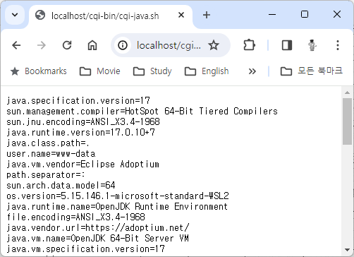

= Lab 2-3 간단한 Java CGI 프로그램 작성 - 1

이 연습에서는 Lab 2-2에서 구성한 환경에서 간단한 Java CGI 프로그램을 작성합니다. 아래 절차에 따릅니다.

|===
|**참고** 이 연습은 Windows 환경에서는 실행되지 않습니다. Windows 환경에서는 wsl을 설치하고, ubuntu 운영체제에서 실습을 수행해야 합니다.
|===

1. Windows, macOS, Linux(Ubuntu)등의 각 환경에서 생성한 cgi-bin 디렉터리에 아래와 같은 CGISample.java 파일을 생성하고 아래와 같이 코드를 작성합니다.
+
[source, java]
----
public class CGIjava {
    public static void main(String[] args) {
        System.out.println("Content-type: text/plain");
        System.out.println();

        System.getProperties().forEach((k, v) -> {
            System.out.println(k + "=" + v);
        });
    }
}
----
+
2. 아래 명령을 실행하여 컴파일합니다.
+
----
$ javac CGISample.java
----
+
3. 아래 명령을 실행하여 컴파일된 Java 파일을 jar 파일로 생성합니다.
+
----
$ jar -cfe CGISample.jar Main CGISample.class
----
+
4. cgi-bin 디렉토리에 cgi-java.sh 파일을 생성하고 아래와 같이 작성합니다.
+
[source, bash]
----
#!/bin/bash
#printf "Content-type: text/plain\n\r\n"
#printf "REQUEST_METHOD=$REQUEST_METHOD\n"

java -jar ./CGIjava.jar
----
+
5. 웹 브라우저를 실행하고 주소창에 http://localhost/cgi-bin/cgi-java.sh 를 입력하고 이동하여 Apache 웹 서버의 실행을 확인합니다.+
+

link:./17_java_cgi_program.adoc[이전: Java CGI Program] +
link:./19_lab2-4.adoc[다음: Lab 2-4 간단한 Java CGI 애플리케이션 작성 - 2]