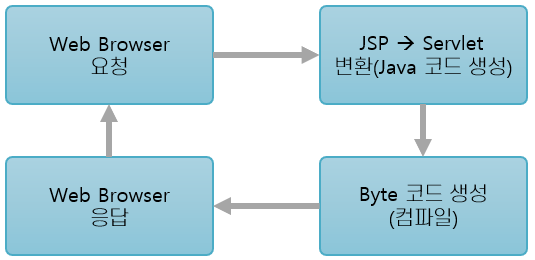

= JSP 동작 방식

1. 브라우저가 웹 서버에게 JSP에 대한 요청 정보 전달
2. JSP 요청이 해당 JSP에 대한 최초 요청인 경우 JSP를 Servlet 코드로 변환
3. Servlet 코드를 컴파일하여 JVM이 실행가능한 Bytecode 생성
4. Servlet 실행, 요청을 처리하고 응답 정보생성 후 전달

---

웹 브라우저 등의 클라이언트에서 서비스가 요청되면, JSP의 실행을 요구합니다. 이때 JSP는 Web Application Server(WAS)의 Servlet Container에서 Servlet 코드로 변환됩니다. 그 후 Servlet 코드는 컴파일 된 후 WAS의  실행되어 결과를 HTML 형태로 클라이언트에 돌려줍니다.

요약하면, JSP 확장자를 WAS로 요청하면, WAS는 Servlet을 생성하여 동적으로 변환한 다음 클라이언트에게 보여주는 형태로 동작합니다. 

link:./03_introduction_jsp.adoc[이전: Java Server Pages 개요] +
link:./05_jsp_tags.adoc[다음: JSP 기본 태그]