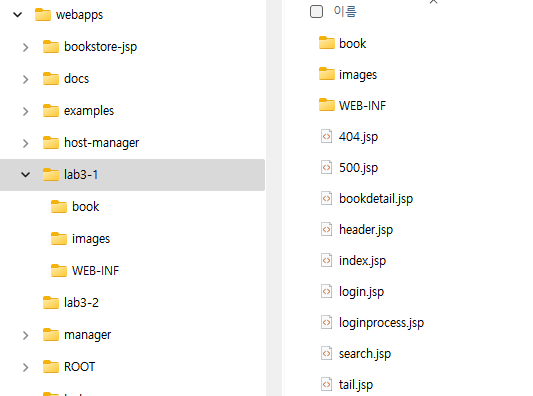
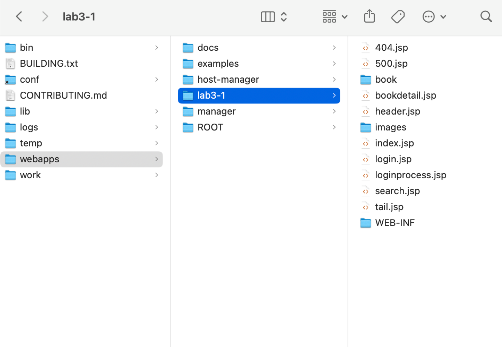

= Lab 3-1 간단한 JSP 응용 프로그램 생성

이 연습에서는 간단한 JSP 응용 프로그램을 생성합니다. 아래 절차에 따릅니다.

== 연습 1 환경 구성

이 연습에서는 Web Application Server인 Tomcat 9를 설치합니다. 아래 절차에 따릅니다.

=== Tomcat 설치

==== Windows 11에서 Tomcat 9 설치

Windows 11에서 Tomcat 9 설치를 위해, 아래 웹 사이트의 설치 안내를 따르십시오.

link:https://github.com/gikpreet/class-environment_settings/blob/main/03_WAS/01_Tomcat/01_install_tomcat_on_windows11.adoc[Windows 11에서 Tomcat 설치]

==== macOS에서 tomcat 9 설치

macOS에서 Tomcat 9 설치를 위해, 아래 웹 사이트의 설치 안내를 따르십시오.

link:https://github.com/gikpreet/class-environment_settings/blob/main/03_WAS/01_Tomcat/02_install_tomcat_on_macos.adoc[macOS에서 Tomcat 설치]

==== Linux(Ubuntu)에서 tomcat 9 설치

Ubuntu에서 Tomcat 9 설치를 위해, 아래 웹 사이트의 설치 안내를 따르십시오.

link:https://github.com/gikpreet/class-environment_settings/blob/main/03_WAS/01_Tomcat/03_install_tomcat_on_linux.adoc[Linux 에서 Tomcat 설치]

Linux(Ubuntu)에서 Tomcat 9 설치를 위해, 아래 웹 사이트의 설치 안내를 따르십시오.

== 연습 2 실습 파일 준비

이 연습에서는 실습 파일을 복사하여 설치된 Tomcat에서 구동될 수 있도록 구성합니다. 아래 절차에 따릅니다.

=== Windows 11에서 실습 파일 준비

1. 아래 링크에서 실습 파일을 다운로드 합니다.
+
https://github.com/gikpreet/class-servlet-jsp/blob/main/Module%2003%20JSP/LabFile/Lab3-1.zip
+
2. 다운로드한 파일의 압축을 해제합니다.
3. 압축을 해제한 폴더의 Lab3-1\Starter 폴더를 아래 폴더로 복사합니다.
+
a. Windows +
c:\apache-tomcat-9.8.xx\webapps\lab3-1
b. macOS 또는 Linux +
tomcat의 webapps/lab3-1 디렉토리
4. 폴더 구조는 아래와 같아야 합니다.
a. windows
+

+
b. macOS
+

+
5. 웹 브라우저를 실행하여 http://localhost:8080 으로 이동하고, Manager App 버튼을 클릭합니다.
6. 로그인 창에서, 사용자 이름과 비밀번호에 admin을 입력하고 로그인합니다.
7. Tomcat 웹 애플리케이션에서 /lab3-1 애플리케이션을 확인합니다.
+
image:../images/image03.png[]
+
8. /lab3-1 애플리케이션을 클릭하여 엽니다. 아래와 같은 웹 애플리케이션이 실행됩니다.
+

+
9. c:\apache-tomcat-9.8.xx\webapps\lab3-1 폴더를 Visual Studio Code에서 엽니다.

== macOS에서 실습 파일 준비

1. 아래 링크에서 실습 파일을 다운로드 합니다.
+
https://github.com/gikpreet/class-servlet-jsp/blob/main/Module%2003%20JSP/LabFile/Lab3-1.zip
+
2. 다운로드한 파일의 압축을 해제합니다.
3. 압축을 해제한 폴더의 Lab3-1 폴더를 /opt/homebrew/Cellar/tomcat@9/9.0.85/libexec/webapps 디렉토리로 복사합니다.
4. 웹 브라우저를 실행하여 http://localhost:8080 으로 이동하고, Manager App 버튼을 클릭합니다.
5. 로그인 창에서, 사용자 이름과 비밀번호에 admin을 입력하고 로그인합니다.
6. Tomcat 웹 애플리케이션에서 /lab3-1 애플리케이션을 확인합니다.
+
image:../images/image03.png[]
+
7. /lab3-1 애플리케이션을 클릭하여 엽니다. 아래와 같은 웹 애플리케이션이 실행됩니다.
+

+
8. /opt/homebrew/Cellar/tomcat@9/9.0.85/libexec/webapps/lab3-1 폴더를 Visual Studio Code에서 엽니다.

== Linux(Ubuntu)에서 실습 파일 준비

1. 아래 링크에서 실습 파일을 다운로드 합니다.
+
https://github.com/gikpreet/class-servlet-jsp/blob/main/Module%2003%20JSP/LabFile/Lab3-1.zip
+
2. 다운로드한 파일의 압축을 해제합니다.
3. 압축을 해제한 폴더의 Lab3-1 폴더를 /var/lib/tomcat9/webapps 디렉토리로 복사합니다.
+
----
$ cp -r ~/Downloads/lab3-1/ /var/lib/tomcat9/webapps/
----
4. 웹 브라우저를 실행하여 http://localhost:8080 으로 이동하고, Manager App 버튼을 클릭합니다.
5. 로그인 창에서, 사용자 이름과 비밀번호에 admin을 입력하고 로그인합니다.
6. Tomcat 웹 애플리케이션에서 /lab3-1 애플리케이션을 확인합니다.
+
image:../images/image03.png[]
+
7. /lab3-1 애플리케이션을 클릭하여 엽니다. 아래와 같은 웹 애플리케이션이 실행됩니다.
+

+
8. /var/lib/tomcat9/webapps/lab3-1 폴더를 Visual Studio Code에서 엽니다.

== 연습 3 실습 파일 준비

1. Visual Studio Code에서, /book 디렉토리의 BookInList.java 파일을 열고 코드를 확인합니다.
+
[source, java]
----
package book;

public class BookInList {
    protected long isbn;
    protected String title;
    protected String subTitle;
    protected String author;
    protected String image;
    protected int unitPrice;

    public static class BookInListBuilder {
        private long isbn;
        private String title;
        private String subTitle;
        private String author;
        private String image;
        private int unitPrice;
    
        public BookInListBuilder(long isbn, String title) {
            this.isbn = isbn;
            this.title = title;
        }
    
        public BookInListBuilder subTitle(String subTitle) {
            this.subTitle = subTitle;
            return this;
        }
    
        public BookInListBuilder author(String author) {
            this.author = author;
            return this;
        }
    
        public BookInListBuilder image(String image) {
            this.image = image;
            return this;
        }
    
        public BookInListBuilder unitPrice(int unitPrice) {
            this.unitPrice = unitPrice;
            return this;
        }
    
        public BookInList build() {
            BookInList bookInList = new BookInList();
            bookInList.isbn = this.isbn;
            bookInList.title = this.title;
            bookInList.subTitle = this.subTitle;
            bookInList.author = this.author;
            bookInList.image = this.image;
            bookInList.unitPrice = this.unitPrice;
            return bookInList;
        }
    }

    public long getIsbn() {
        return this.isbn;
    }

    public String getTitle() {
        return this.title;
    }

    public String getSubTitle() {
        return this.subTitle;
    }

    public String getAuthor() {
        return this.author;
    }

    public String getImage() {
        return this.image;
    }

    public int getUnitPrice() {
        return this.unitPrice;
    }
}
----
+
2. BookFactory.java 파일을 열고 코드를 확인합니다.
+
[source, java]
----
package book;

import java.io.BufferedReader;
import java.io.InputStreamReader;
import java.util.Hashtable;

public class BookRepository {
    private Hashtable<Integer, String[]> bookData;
    private static BookRepository repository;

    private BookRepository() {
        readData();
    }

    public static BookRepository getBookRepository() {
        if (repository == null) {
            repository = new BookRepository();
        }
        return repository;
    }

    public Hashtable<Integer, String[]> getData() {
        return this.bookData;
    }

    public void readData() {
        this.bookData = new Hashtable<>();
        String line = "";

        try (BufferedReader reader = new BufferedReader(new InputStreamReader(BookRepository.class.getResourceAsStream("book.csv"), "UTF-8"))) {
            while((line = reader.readLine()) != null) {
                String[] data = line.split("\\|");
                this.bookData.put(Integer.parseInt(data[0]), data);
            }
        }
        catch (Exception e) {
            e.printStackTrace();
        }
    }
}
----
+
3. 터미널을 열고, book 디렉토리로 이동합니다.
+
----
$ cd book
----
+
4. 아래 명령을 실행하여 소스 파일을 컴파일합니다.
+
----
$ javac -encoding UTF-8 *.java
----
+
5. 아래 명령을 실행하여 컴파일된 바이트코드 파일을 WEB-INF/classes/book 디렉토리로 이동합니다.
+
**Windows**
+
----
$ move *.class ..\WEB-INF\classes/book
----
+
**macOS or Linux**
+
----
$ sudo mv ./*.class ../WEB-INF/classes/book
----

== 연습 4 책 목록을 보여주는 JSP 페이지 작성

1. index.jsp 파일을 엽니다.
2. Todo 1 구역에, page 지시어를 작성합니다.
+
[source, html]
----
<%@ page language="java" contentType="text/html" pageEncoding="UTF-8" %>
----
+
3. header.jsp 파일을 열고 코드를 확인합니다.
+
[source, html] 
----
<html>
<header>
    <title>Book Store</title>
</header>
<body>
<%
    String userName = session.getId();
%>
<table cellpadding="7" cellspacing="0" width="100%" bgcolor="black" border="0">
    <tr>
        <td width="800" height="60" rowspan="2">
            
        </td>
        <td valign="bottom">
            <%= userName %>
            <a href="login.jsp">로그인</a>
        </td>
    </tr>
    <tr>
        <form method="post" action="search.jsp">
        <td height="10">
                <input type="text" name="searchString" />
                <input type="submit" value="검색" />        
        </td>
        </form>
    </tr>
</table>
----
+
4. tail.jsp 파일을 열고 코드를 확인합니다.
+
[source, html]
----

<table cellpadding="0" cellspacing="3" width="100%">
    <tr>
        <td width="100" valign="top" style="align-items:top;padding:0px">
            
        </td>
        <td style="padding:0px" valign="middle">
            
Datamotion(R) Data Analytics Service all right reserved 
            since 2006

        </td>
    </tr>
<table>
</body>
<html>
----
+
5. index.jsp 파일을 열고 Todo 2 구역에 include 지시어를 사용하여 header.jsp 파일을 삽입합니다.
+
[source, html]
----
<%@ include file="./header.jsp" %>
----
+
6. index.jsp 파일의 Todo 3 구역에 include 지시어를 사용하여 tail.jsp 파일을 삽입합니다.
+
[source, html]
----
<%@ include file="./tail.jsp" %>
----
+
7. 전체 index.jsp 페이지는 아래와 유사할 것입니다.
+
[source, html]
----
<%@ page language="java" contentType="text/html" pageEncoding="UTF-8" %>

<%@ include file="./header.jsp" %>

<table width="1000">
    <tr>
        <td>
            <!-- Toto 5: insert codes for show top 5 book list -->
            <h1>Book Store</h1>
        </td>
    </tr>
</table>

<%@ include file="./tail.jsp" %>
----
+
8. 웹 브라우저를 실행하여 http://localhost:8080/lab3-1 로 이동하여 페이지를 확인합니다.
+

+
9. Visual Studio Code에서, index.jsp 페이지의 Todo 4 구역에 아래와 같은 import를 삽입합니다.
+
[source, html]
----
<%@ page import="java.util.List" %>
<%@ page import="java.util.ArrayList" %>
<%@ page import="book.BookInList" %>
<%@ page import="book.BookFactory" %>
----
+
10. Todo 5 구역에서, BookFactory 클래스의 getBest5Books 메소드를 호출하여 반환받은 ArrayList를 사용하여 책의 목록을 화면에 보여주는 코드를 작성합니다.
+
[source, html]
----
<table width=600>
    <%
    List<BookInList> list = BookFactory.getBookFactory().getBest5Books();

    for(BookInList book: list) {
    %>
        <tr>
            <td width="52">" width="50" /></td>
                <td>
                    <%= book.getTitle() %> <%= book.getSubTitle() %> 
                    <%= book.getAuthor() %> 
                    <%= book.getUnitPrice() %>
                </td>
        </tr>
    <%
    }
    %>
</table>
----
+
11. 전체 index.jsp 페이지는 아래와 유사할 것입니다.
+
[source, html]
----
<%@ page language="java" contentType="text/html" pageEncoding="UTF-8" %>
<%@ page import="java.util.List" %>
<%@ page import="java.util.ArrayList" %>
<%@ page import="book.BookInList" %>
<%@ page import="book.BookFactory" %>

<%@ include file="./header.jsp" %>

<body>
<table width="1000">
    <tr>
        <td>
            <table width=600>
                <%
                List<BookInList> list = BookFactory.getBest5Books();

                for(BookInList book: list) {
                %>
                    <tr>
                        <td width="52">" width="50" /></td>
                        <td>
                            <%= book.getTitle() %> <%= book.getSubTitle() %> 
                            <%= book.getAuthor() %> 
                            <%= book.getUnitPrice() %>
                        </td>
                    </tr>
                <%
                }
                %>
            </table>
        </td>
    </tr>
</table>
</body>

<%@ include file="./tail.jsp" %>
----
+
12. 웹 브라우저를 실행하여 http://localhost:8080/lab3-1 로 이동하여 페이지를 확인합니다.
+
image:../images/image08.png[width=650]

link:./06_jsp_tags.adoc[이전: JSP 기본 태그] +
link:./08_implicit_object.adoc[다음: JSP 내장 객체]