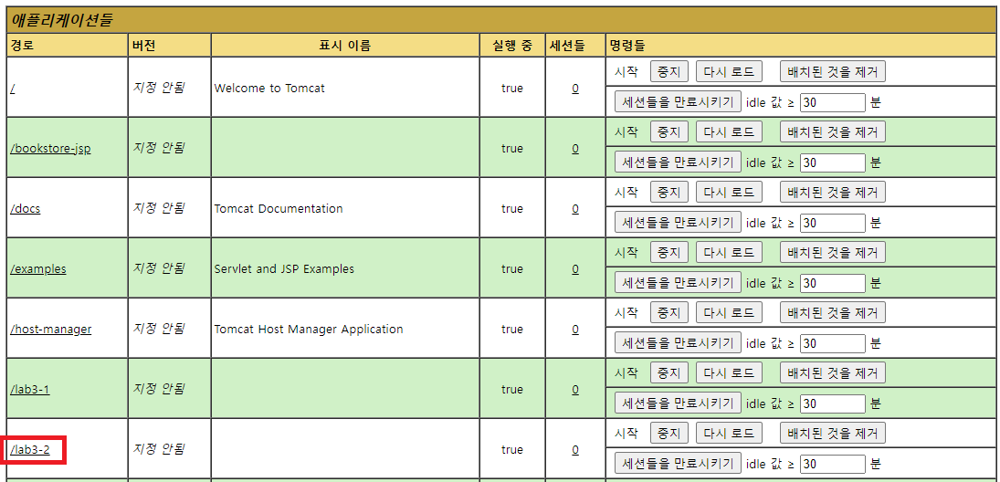
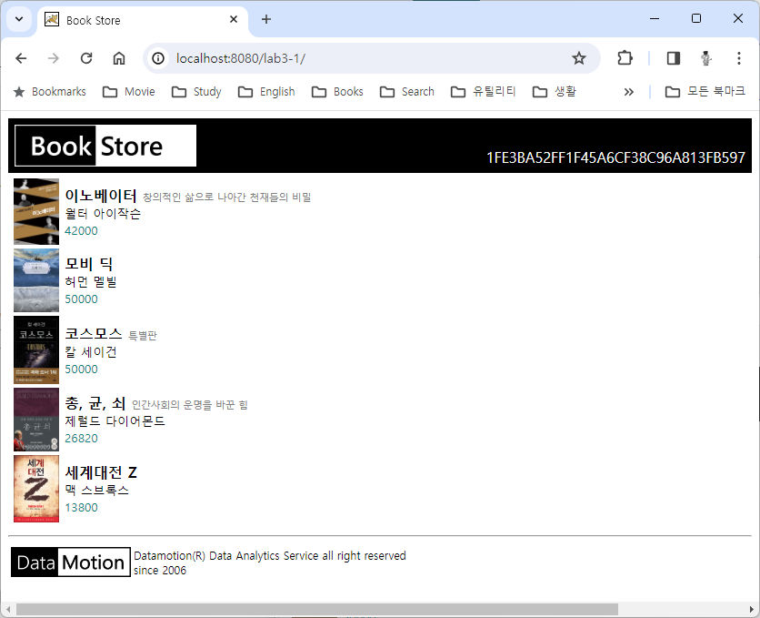
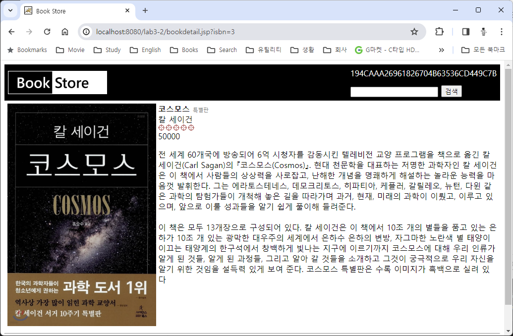
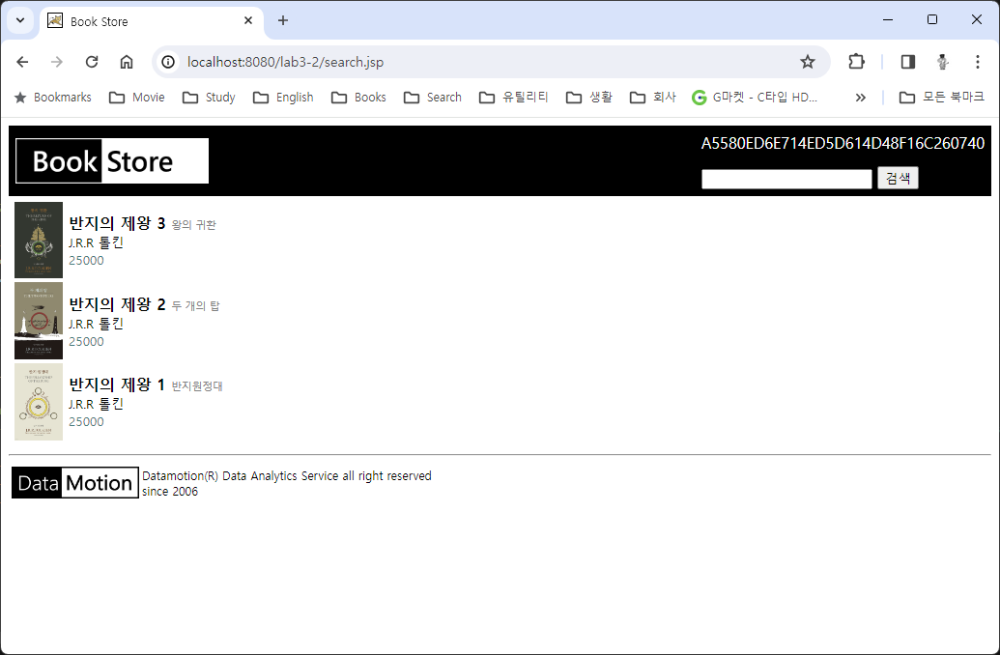

= Lab 3-2 응용 프로그램에 검색 추가

이 연습에서는 연습 3-1에서 작성한 프로그램에 링크 기능과 상품 검색 기능을 추가합니다. 아래 절차에 따릅니다.

== 연습 1 실습 파일 준비

=== Windows 11에서 실습 파일 준비

1. 아래 링크에서 실습 파일을 다운로드 합니다.
+
https://github.com/gikpreet/class-servlet-jsp/blob/main/Module%2003%20JSP/LabFile/lab3-2.zip
+
2. 다운로드한 파일의 압축을 해제합니다.
3. 압축을 해제한 폴더의 Starter 폴더를 c:\apache-tomcat-9.8.xx\webapps 폴더로 복사합니다.
4. 웹 브라우저를 실행하여 http://localhost:8080 으로 이동하고, Manager App 버튼을 클릭합니다.
5. 로그인 창에서, 사용자 이름과 비밀번호에 admin을 입력하고 로그인합니다.
6. Tomcat 웹 애플리케이션에서 /lab3-2 애플리케이션을 확인합니다.
+

+
7. /lab3-2 애플리케이션을 클릭하여 엽니다. 아래와 같은 웹 애플리케이션이 실행됩니다.
+

+
8. c:\apache-tomcat-9.8.xx\webapps\lab3-1 폴더를 Visual Studio Code에서 엽니다.

== macOS에서 실습 파일 준비

1. 아래 링크에서 실습 파일을 다운로드 합니다.
+
https://github.com/gikpreet/class-servlet-jsp/blob/main/Module%2003%20JSP/LabFile/lab3-2.zip
+
2. 다운로드한 파일의 압축을 해제합니다.
3. 압축을 해제한 폴더의 Starter 폴더를 /opt/homebrew/Cellar/tomcat@9/9.0.85/libexec/webapps 디렉토리로 복사합니다.
4. 웹 브라우저를 실행하여 http://localhost:8080 으로 이동하고, Manager App 버튼을 클릭합니다.
5. 로그인 창에서, 사용자 이름과 비밀번호에 admin을 입력하고 로그인합니다.
6. Tomcat 웹 애플리케이션에서 /lab3-1 애플리케이션을 확인합니다.
+

+
7. /lab3-2 애플리케이션을 클릭하여 엽니다. 아래와 같은 웹 애플리케이션이 실행됩니다.
+

+
8. /opt/homebrew/Cellar/tomcat@9/9.0.85/libexec/webapps/lab3-1 폴더를 Visual Studio Code에서 엽니다.

== Linux(Ubuntu)에서 실습 파일 준비

1. 아래 링크에서 실습 파일을 다운로드 합니다.
+
https://github.com/gikpreet/class-servlet-jsp/blob/main/Module%2003%20JSP/LabFile/lab3-2.zip
+
2. 다운로드한 파일의 압축을 해제합니다.
3. 압축을 해제한 폴더의 Starter 폴더를 /var/lib/tomcat9/webapps 디렉토리로 복사합니다.
+
----
$ cp -r ~/Downloads/lab3-2/ /var/lib/tomcat9/webapps/
----
4. 웹 브라우저를 실행하여 http://localhost:8080 으로 이동하고, Manager App 버튼을 클릭합니다.
5. 로그인 창에서, 사용자 이름과 비밀번호에 admin을 입력하고 로그인합니다.
6. Tomcat 웹 애플리케이션에서 /lab3-1 애플리케이션을 확인합니다.
+

+
7. /lab3-1 애플리케이션을 클릭하여 엽니다. 아래와 같은 웹 애플리케이션이 실행됩니다.
+

+
8. /var/lib/tomcat9/webapps/lab3-1 폴더를 Visual Studio Code에서 엽니다.

== 연습 2 상품 상세 정보를 보여주는 페이지 작성

1. Visual Studio Code에서 bookdetail.jsp 파일을 열고 코드를 확인합니다.
2. Todo 1 구역에서, isbn Request Parameter를 전달받아 Book 객체를 생성하는 코드를 작성합니다. Book 객체는 BookFactory 싱글턴 클래스의 getBookInfo 메소드에 isbn을 파라미터로 전달하여 얻을 수 있습니다. 작성된 코드는 아래와 유사할 것입니다.
+
[source, java]
----
<%
    String isbn = request.getParameter("isbn");
    Book book = BookFactory.getBookFactory().getBookInfo(Integer.parseInt(isbn));
%>
----

3. 터미널을 실행합니다.
4. 아래 명령을 실행하고 메시지를 확인합니다.
+
----
$ >curl -X GET -vI http://localhost:8080/lab3-2/bookdetail.jsp?isbn=5
*   Trying [::1]:8080...
* Connected to localhost (::1) port 8080
> GET /lab3-2/bookdetail.jsp?isbn=5 HTTP/1.1
> Host: localhost:8080
> User-Agent: curl/8.4.0
> Accept: */*
>
< HTTP/1.1 200
HTTP/1.1 200
< Set-Cookie: JSESSIONID=E5740FBF526D3D44F88CB82DA7DBB7B2; Path=/lab3-2; HttpOnly
Set-Cookie: JSESSIONID=E5740FBF526D3D44F88CB82DA7DBB7B2; Path=/lab3-2; HttpOnly
< Content-Type: text/html;charset=UTF-8
Content-Type: text/html;charset=UTF-8
< Content-Length: 3088
Content-Length: 3088
< Date: Wed, 20 Mar 2024 04:46:22 GMT
Date: Wed, 20 Mar 2024 04:46:22 GMT

<
* Excess found: excess = 3088 url = /lab3-2/bookdetail.jsp (zero-length body)
* Connection #0 to host localhost left intact
----
+
5. index.jsp 페이지를 엽니다.
6. Todo 2 구역에서, 책 제목을 표시하는 코드를 bookdetail 페이지 링크로 변경합니다. 링크는 isbn 파라미터를 가지며 책의 isbn 값으로 전달합니다. 코드는 아래와 유사할 것입니다.
+
[source, html]
----
<a href="bookdetail.jsp?isbn=<%= book.getIsbn() %>"><%= book.getTitle() %></a> <%= book.getSubTitle() %> 
----
+
7. 웹 브라우저에서 주소창에 http://localhost:8080/lab3-2/ 을 입력하고 이동합니다.
8. 책의 제목에 생성된 링크를 확인합니다.
9. 코스모스를 클릭하고 bookdetail.jsp 페이지를 확인합니다.
+

=== 연습 3 상품 검색 페이지 작성

1. Visual Studio Code에서 Header.jsp 파일을 엽니다.
2. <form> 태그를 확인합니다. form 태그는 POST 방식으로 동작하며, search.jsp 파일에 대한 요청을 전송합니다.
+
[source, html]
----
<form method="post" action="search.jsp">
    <input type="text" name="searchString" />
    <input type="submit" value="검색" />        
</form>
----
+
3. search.jsp 파일을 엽니다.
4. Todo 3 구역에서, searchString 요청 파라미터를 전달받아 응답 결과를 작성하는 코드를 작성합니다. 응답 결과는 BookFactory 싱글턴 객체의 searchByTitle 메소드 호출로 List<BookInList> 타입으로 전달받을 수 있습니다. 전달받은 List를 반복하여 검색된 책 목록을 화면에 보여주는 코드를 작성합니다. 코드는 아래와 유사할 것입니다.
+
[source, java]
----
request.setCharacterEncoding("UTF-8");
String searchString = request.getParameter("searchString");
List<BookInList> list = BookFactory.getBookFactory().searchByTitle(searchString);

for(BookInList book: list) {
%>
    <tr>
        <td width="52">" width="50" /></td>
        <td>
            <a href="bookdetail.jsp?isbn=<%= book.getIsbn() %>"><%= book.getTitle() %></a> <%= book.getSubTitle() %> 
            <%= book.getAuthor() %> 
            <%= book.getUnitPrice() %>
         </td>
</tr>
<%
}
%>
----
+
5. 웹 브라우저에서 주소창에 http://localhost:8080/lab3-2/ 을 입력하고 이동합니다.
6. 검색 상자에 '반지'를 입력하고 검색 버튼을 클릭합니다.
7. search.jsp 페이지에서 검색 결과를 확인합니다.
+

+
8. 터미널을 실행합니다.
9. 아래 명령을 실행하고 메시지를 확인합니다.
+
**Windows**
+
----
curl -d "searchString=반지" -v -X POST http://localhost:8080/lab3-2/search.jsp
----
+
**macOS or Linux**
+
----
curl -d 'searchString=반지; -v -X POST http://localhost:8080/lab3-2/search.jsp
----
+
----
Note: Unnecessary use of -X or --request, POST is already inferred.
*   Trying [::1]:8080...
* Connected to localhost (::1) port 8080
> POST /lab3-2/search.jsp HTTP/1.1
> Host: localhost:8080
> User-Agent: curl/8.4.0
> Accept: */*
> Content-Length: 19
> Content-Type: application/x-www-form-urlencoded
>
< HTTP/1.1 200
< Set-Cookie: JSESSIONID=5B3C6DA1F236A17C6C3FF85283CC6735; Path=/lab3-2; HttpOnly
< Content-Type: text/html;charset=UTF-8
< Content-Length: 3951
< Date: Wed, 20 Mar 2024 08:43:40 GMT
<

<html>
<header>
    <title>Book Store</title>
</header>
<body>
<table cellpadding="7" cellspacing="0" width="100%" bgcolor="black" border="0">
    <tr>
        <td width="800" height="60" rowspan="2">
            
        </td>
        <td valign="bottom">
            5B3C6DA1F236A17C6C3FF85283CC6735
        </td>
    </tr>
    <tr>
        <form method="post" action="search.jsp">
        <td height="10">
                <input type="text" name="searchString" />
                <input type="submit" value="검색" />
        </td>
        </form>
    </tr>
</table>

<table width="1000">
    <tr>
        <td>
            <table width=600>

                    <tr>
                        <td width="52"></td>
                            <td>
                                <!-- Todo 1: replace to link to bookdetail.jsp
                                <a href="bookdetail.jsp?isbn=11">반지의 제왕 3</a> 왕의 귀환 
                                -->
                                반지의 제왕 3 왕의 귀환 
                                J.R.R 톨킨 
                                25000
                            </td>
                    </tr>

                    <tr>
                        <td width="52"></td>
                            <td>
                                <!-- Todo 1: replace to link to bookdetail.jsp
                                <a href="bookdetail.jsp?isbn=10">반지의 제왕 2</a> 두 개의 탑 
                                -->
                                반지의 제왕 2 두 개의 탑 
                                J.R.R 톨킨 
                                25000
                            </td>
                    </tr>

                    <tr>
                        <td width="52"></td>
                            <td>
                                <!-- Todo 1: replace to link to bookdetail.jsp
                                <a href="bookdetail.jsp?isbn=9">반지의 제왕 1</a> 반지원정대 
                                -->
                                반지의 제왕 1 반지원정대 
                                J.R.R 톨킨 
                                25000
                            </td>
                    </tr>

            </table>
        </td>
    </tr>
</table>

<table cellpadding="0" cellspacing="3" width="100%">
    <tr>
        <td width="100" valign="top" style="align-items:top;padding:0px">
            
        </td>
        <td style="padding:0px" valign="middle">
            
Datamotion(R) Data Analytics Service all right reserved 
            since 2006

        </td>
    </tr>
<table>
</body>
<html>* Connection #0 to host localhost left intact
----

link:./11_response.adoc[이전: response 객체] +
link:./13_application.adoc[이전: application 객체]