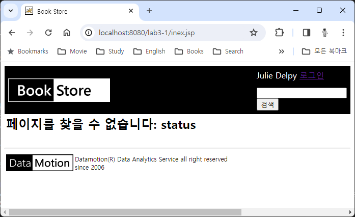
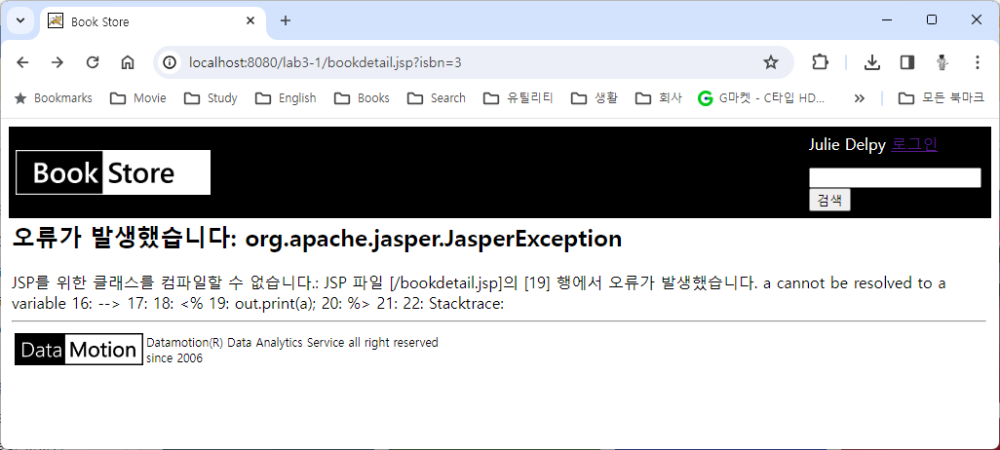

= Lab 3-4 오류 페이지 처리

이 연습에서는 연습 3-3에서 작성한 프로그램에 페이지 오류 처리 기능을 추가합니다. 아래 절차에 따릅니다.

== 연습 1 실습 파일 준비

=== Windows 11에서 실습 파일 준비

1. 아래 링크에서 실습 파일을 다운로드 합니다.
+
https://github.com/gikpreet/class-servlet-jsp/blob/main/Module%2003%20JSP/LabFile/lab3-4.zip
+
2. 다운로드한 파일의 압축을 해제합니다.
3. 압축을 해제한 폴더의 Starter 폴더를 c:\apache-tomcat-9.8.xx\webapps 폴더로 복사합니다.
4. 웹 브라우저를 실행하여 http://localhost:8080 으로 이동하고, Manager App 버튼을 클릭합니다.
5. 로그인 창에서, 사용자 이름과 비밀번호에 admin을 입력하고 로그인합니다.
6. Tomcat 웹 애플리케이션에서 /lab3-4 애플리케이션을 확인합니다.
7. /lab3-2 애플리케이션을 클릭하여 엽니다. 아래와 같은 웹 애플리케이션이 실행됩니다.
8. c:\apache-tomcat-9.8.xx\webapps\lab3-4 폴더를 Visual Studio Code에서 엽니다.

== macOS에서 실습 파일 준비

1. 아래 링크에서 실습 파일을 다운로드 합니다.
+
https://github.com/gikpreet/class-servlet-jsp/blob/main/Module%2003%20JSP/LabFile/lab3-4.zip
+
2. 다운로드한 파일의 압축을 해제합니다.
3. 압축을 해제한 폴더의 Starter 폴더를 /opt/homebrew/Cellar/tomcat@9/9.0.85/libexec/webapps 디렉토리로 복사합니다.
4. 웹 브라우저를 실행하여 http://localhost:8080 으로 이동하고, Manager App 버튼을 클릭합니다.
5. 로그인 창에서, 사용자 이름과 비밀번호에 admin을 입력하고 로그인합니다.
6. Tomcat 웹 애플리케이션에서 /lab3-4 애플리케이션을 확인합니다.
7. /lab3-2 애플리케이션을 클릭하여 엽니다. 아래와 같은 웹 애플리케이션이 실행됩니다.
8. /opt/homebrew/Cellar/tomcat@9/9.0.85/libexec/webapps/lab3-4 폴더를 Visual Studio Code에서 엽니다.

== Linux(Ubuntu)에서 실습 파일 준비

1. 아래 링크에서 실습 파일을 다운로드 합니다.
+
https://github.com/gikpreet/class-servlet-jsp/blob/main/Module%2003%20JSP/LabFile/lab3-4.zip
+
2. 다운로드한 파일의 압축을 해제합니다.
3. 압축을 해제한 폴더의 Starter 폴더를 /var/lib/tomcat9/webapps 디렉토리로 복사합니다.
+
----
$ cp -r ~/Downloads/lab3-4/Starter /var/lib/tomcat9/webapps/
----
4. 웹 브라우저를 실행하여 http://localhost:8080 으로 이동하고, Manager App 버튼을 클릭합니다.
5. 로그인 창에서, 사용자 이름과 비밀번호에 admin을 입력하고 로그인합니다.
6. Tomcat 웹 애플리케이션에서 /lab3-4 애플리케이션을 확인합니다.
7. /lab3-1 애플리케이션을 클릭하여 엽니다. 아래와 같은 웹 애플리케이션이 실행됩니다.
8. /var/lib/tomcat9/webapps/lab3-4 폴더를 Visual Studio Code에서 엽니다.

== 연습 2 오류 페이지 처리

1. WEB-INF/ 디렉토리에서 web.xml 파일을 엽니다.
2. Todo 1 구역에서 400과 500 HTML 오류를 처리하는 요소를 작성합니다. 400 오류는 /400.jsp, 500 오류는 /500.jsp 페이지가 처리합니다. 코드는 아래와 유사할 것입니다.
+
[source, xml]
----
<?xml version="1.0" encoding="UTF-8"?>
<web-app xmlns="http://xmlns.jcp.org/xml/ns/javaee"
  xmlns:xsi="http://www.w3.org/2001/XMLSchema-instance"
  xsi:schemaLocation="http://xmlns.jcp.org/xml/ns/javaee
                      http://xmlns.jcp.org/xml/ns/javaee/web-app_4_0.xsd"
  version="4.0">

  <error-page>
    <error-code>404</error-code>
    <location>/404.jsp</location>
  </error-page>
  <error-page>
    <error-code>500</error-code>
    <location>/500.jsp</location>
  </error-page>
</web-app>
----
+
3. 500.jsp 페이지를 엽니다.
4. Todo 2 구역에서 HTTP 상태 코드, Exception 타입, 메시지를 보여주는 코드를 작성합니다. 코드는 아래와 유사할 것입니다.
+
[source, html]
----
<%
    int status = response.getStatus();
    String errorName = exception.getClass().getName();
    String message = exception.getMessage();
%>
----
5. 웹 브라우저를 열고 http://localhost:8080/lab3-4/inex.jsp 페이지를 엽니다.
6. 오류 페이지를 확인합니다.
+

+
|===
|**참고** 404 오류 페이지 적용에는 시간이 소요될 수 있습니다. 404 오류 페이지가 동작하지 않을 경우 tomcat 페이지에서 응용 프로그램을 다시 로드 한 후 시도하십시오.
|===
+
7. bookdetail.jsp 페이지를 엽니다.
8. 예외를 일으키는 코드 추가 부분에 예외를 발생하는 코드를 작성합니다.
+
<예>
+
----
<%
    out.print(a);
%>
----
+
9. 웹 브라우저에서 http://localhost:8080/lab3-4/bookdetail.jsp?isbn=3 페이지를 열고 처리된 오류를 확인합니다.
+

link:./21_exception.adoc[이전: exception 객체] +
link:./23_scope.adoc[다음: 내장 객체의 범위]