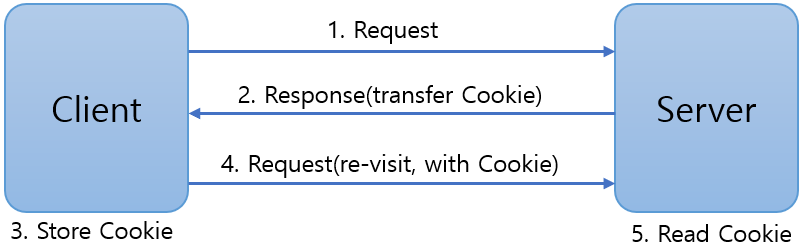

= Cookie

* 클라이언트의 상태를 유지하기 위한 기술
* key-value 형태로 클라이언트에 저장 후 서버로 전송
* RFC 6265 제약
** 3000개 까지 생성 가능
** 최대 크기 4096 바이트
** 하나의 호스트나 도메인에서 최대 50개까지 사용 가능

---

Cookie는 클라이언트의 상태를 유지하기 위한 기술입니다. 상태 정보를 클라이언트에 Key-Value 형태로 저장하고, 서버는 저장된 정보를 읽어서 필요한 동작을 처리할 수 있습니다. 

== Cookie의 동작

Cookie의 동작은 아래와 같은 절차로 이루어집니다.

1. 클라이언트가 서버로 Request를 보냅니다.
2. 서버가 Cookie를 생성하여 HTTP Response Header로 클라이언트에 전송합니다.
3. 클라이언트는 지정된 Cookie 저장소에 전송받은 Cookie를 저장합니다.
4. 클라이언트는 다음 Request에 Cookie를 HTTP 요청 헤더와 함께 전송합니다.
5. 서버는 Cookie 정보를 읽어 동작을 처리합니다.

Cookie는 아래와 같은 속성을 가집니다.

* **name** Cookie의 식별자입니다.
* **value** Cookie의 값을 저장합니다.
* **domain** Cookie를 적용할 도메인 이름입니다.
* **path** Cookie를 적용할 경로입니다.
* **max age** Cookie가 유지되는 시간입니다.

== Cookie 메소드

[%header, cols="2,1,3"]
|===
|메소드|return type|설명
|.ctor(String name, String value)||name과 value를 파라미터로 Cookie를 생성합니다
|setValue(String value)|void|Cookie의 값을 설정합니다
|setDomain(String domain)|void|Cookie에 적용할 도메인을 설정합니다.
|setPath(String path)|void|Cookie가 적용될 경로를 지정합니다.
|setMaxAge(int expiresecond)|void|Cookie가 지정될 시간을 초 단위로 설정합니다. 기간을 설정하지 않으면 브라우저가 닫힐 때 삭제됩니다.
|getCookies{}|Cookie[]|
|getName()|String|Cookie의 이름을 가져옵니다.
|getValue()|String|Cookie의 값을 가져옵니다.
|getDomain()|String|Cookie에 적용된 도메인의 값을 가져옵니다.
|getPath()|String|Cookie에 적용된 경로를 가져옵니다.
|getMaxAge()|String|int|Cookie에 지정된 지속 시간을 가져옵니다.
|===

Cookie의 전체 메소드는 https://docs.oracle.com/javaee%2F7%2Fapi%2F%2F/javax/servlet/http/Cookie.html 을 참조합니다.

link:./22_scope.adoc[이전: 내장 객체의 범위] +
link:./24_lab3-5.adoc[다음: Lab 3-5 Cookie 설정]