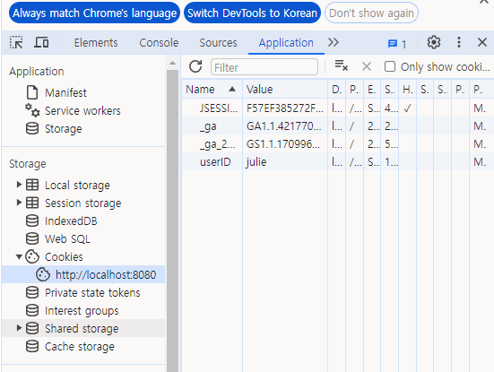
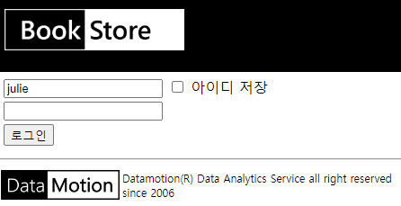

= Lab 3-5 로그인 정보에 Cookie 사용

이번 연습에서는 사용자 로그인에 Cookie를 설정하여 로그인이 지속되도록 설정합니다. 아래 절차에 따릅니다.

== 연습 1 실습 파일 준비

=== Windows 11에서 실습 파일 준비

1. 아래 링크에서 실습 파일을 다운로드 합니다.
+
https://github.com/gikpreet/class-servlet-jsp/blob/main/Module%2003%20JSP/LabFile/lab3-5.zip
+
2. 다운로드한 파일의 압축을 해제합니다.
3. 압축을 해제한 폴더의 Starter 폴더를 c:\apache-tomcat-9.8.xx\webapps 폴더로 복사합니다.
4. 웹 브라우저를 실행하여 http://localhost:8080 으로 이동하고, Manager App 버튼을 클릭합니다.
5. 로그인 창에서, 사용자 이름과 비밀번호에 admin을 입력하고 로그인합니다.
6. Tomcat 웹 애플리케이션에서 /lab3-5 애플리케이션을 확인합니다.
7. /lab3-2 애플리케이션을 클릭하여 엽니다. 아래와 같은 웹 애플리케이션이 실행됩니다.
8. c:\apache-tomcat-9.8.xx\webapps\lab3-5 폴더를 Visual Studio Code에서 엽니다.

== macOS에서 실습 파일 준비

1. 아래 링크에서 실습 파일을 다운로드 합니다.
+
https://github.com/gikpreet/class-servlet-jsp/blob/main/Module%2003%20JSP/LabFile/lab3-4.zip
+
2. 다운로드한 파일의 압축을 해제합니다.
3. 압축을 해제한 폴더의 Starter 폴더를 /opt/homebrew/Cellar/tomcat@9/9.0.85/libexec/webapps 디렉토리로 복사합니다.
4. 웹 브라우저를 실행하여 http://localhost:8080 으로 이동하고, Manager App 버튼을 클릭합니다.
5. 로그인 창에서, 사용자 이름과 비밀번호에 admin을 입력하고 로그인합니다.
6. Tomcat 웹 애플리케이션에서 /lab3-5 애플리케이션을 확인합니다.
7. /lab3-2 애플리케이션을 클릭하여 엽니다. 아래와 같은 웹 애플리케이션이 실행됩니다.
8. /opt/homebrew/Cellar/tomcat@9/9.0.85/libexec/webapps/lab3-5 폴더를 Visual Studio Code에서 엽니다.

== Linux(Ubuntu)에서 실습 파일 준비

1. 아래 링크에서 실습 파일을 다운로드 합니다.
+
https://github.com/gikpreet/class-servlet-jsp/blob/main/Module%2003%20JSP/LabFile/lab3-4.zip
+
2. 다운로드한 파일의 압축을 해제합니다.
3. 압축을 해제한 폴더의 Starter 폴더를 /var/lib/tomcat9/webapps 디렉토리로 복사합니다.
+
----
$ cp -r ~/Downloads/lab3-4/Starter /var/lib/tomcat9/webapps/
----
4. 웹 브라우저를 실행하여 http://localhost:8080 으로 이동하고, Manager App 버튼을 클릭합니다.
5. 로그인 창에서, 사용자 이름과 비밀번호에 admin을 입력하고 로그인합니다.
6. Tomcat 웹 애플리케이션에서 /lab3-5 애플리케이션을 확인합니다.
7. /lab3-1 애플리케이션을 클릭하여 엽니다. 아래와 같은 웹 애플리케이션이 실행됩니다.
8. /var/lib/tomcat9/webapps/lab3-5 폴더를 Visual Studio Code에서 엽니다.

== 연습 2 로그인 정보에 Cookie 사용

1. Visual Studio Code에서 login.jsp 파일을 엽니다.
2. Todo 1 구역에서 Cookie 클래스를 import 합니다.
+
----
<%@ page import="javax.servlet.http.Cookie" %>
----
+
3. Todo 2 구역에서, userID 쿠키를 가져와서 userID 변수에 할당하는 코드를 작성합니다. Cookie는 request 내장 객체의 getCookies 메소드를 사용해 Cookie 객체 배열로 반환받을 수 있습니다. 작성된 코드는 아래와 유사할 것입니다.
+
[source, java]
----
Cookie[] cookies = request.getCookies();
for (Cookie c: cookies) {
    if (c.getName().contains("userID")) {
        userID = c.getValue();
    }
}
----
+
4. loginprocess.jsp 파일을 엽니다.
5. Todo 3 구역에서, userID 값을 userID 쿠키로 작성하는 코드를 작성합니다. 작성된 코드는 아래와 유사할 것입니다.
+
[source, java]
----
response.addCookie(new Cookie("userID", userID));
----
6. 웹 브라우저를 실행합니다.
7. http://localhost:8080/lab3-1/login.jsp 페이지로 이동합니다.
8. `아이디 저장` 체크박스를 선택하고 julie, P@ssw0rd로 로그인합니다.
9. Chrome 브라우저에서, F12 키를 눌러 개발자 도구를 엽니다.
10. Application 탭에서 localhost:8080의 Cookie를 확인합니다.
+

+
11. 로그인 페이지로 이동하여 사용자 ID가 표시되는 것을 확인합니다.
+

+
12. 모든 웹 브라우저를 종료합니다.
13. 웹 브라우저를 실행하고, http://localhost:8080/lab3-1/login.jsp 로 이동합니다.
14. 사용자 ID가 표시되지 않는 것을 확인합니다.

link:./24_cookie.adoc[이전: Cookie]