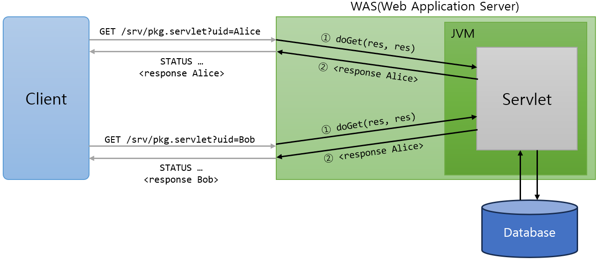

= Servlet 개요

* Java EE의 하위 기술로, Java EE에서 웹 기반 기술을 담당
* 클라이언트의 Request에 대해 동적으로 작동하는 웹 어플리케이션 컴포넌트
* 기존의 정적 웹 프로그램의 문제점을 보완하여 동적인 여러 가지 기능을 제공
* JAVA의 스레드를 이용하여 동작
* MVC패턴에서 컨트롤러로 이용됨
* 컨테이너에서 실행
* 보안 기능을 적용하기 쉬움

---

Servlet은 Java EE (Java Enterprise Edition)의 하위 기술로, Servlet은 Java EE (Java Enterprise Edition)의 하위 기술로, 기업형 Java 응용 프로그램 개발 환경에서 웹 기반의 Client/Server 기술을 담당합니다. 웹 기반의 Client/Server 기술을 담당합니다. Java EE 기술은 link:https://www.oracle.com/java/technologies/javaee/javaeetechnologies.html[Oracle Website]footnote:[2024년 Java EE 8의 Servlet 버전은 4.0, JSP 버전은 2.3입니다] 에서 확인할 수 있습니다.

Servlet은 Java 기반의 CGI 프로그램이며, 웹 요청과 응답의 흐름을 간단한 메서드 호출만으로 체계적으로 다룰 수 있게 해 줍니다. Servlet은 서버에서 실행되다가 웹 브라우저에서 요청을 하면 해당 기능을 수행한 후 웹 브라우저에 결과를 전송합니다.

Servlet의 주요 특징은 아래와 같습니다.

* 클라이언트의 Request에 대해 동적으로 작동하는 웹 어플리케이션 컴포넌트
* 기존의 정적 웹 프로그램의 문제점을 보완하여 동적인 여러 가지 기능을 제공
* JAVA의 스레드를 이용하여 동작
* MVC패턴에서 컨트롤러로 이용됨
* 컨테이너에서 실행: 스레드의 생성과 관리를 담당
* 보안 기능을 적용하기 쉬움