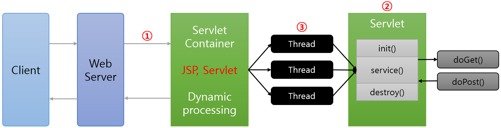

= Servlet의 동작 과정

* 멀티 스레드로 동작
** 요청마다 새로운 프로세스를 생성하는 CGI의 단점을 해결
* 스레드의 생성과 관리를 위한 컨테이너(WAS)를 사용
** 사용자의 개입이 필요없는 멀티 스레드 관리

---

클라이언트가 웹 서버에 요청을 전달하면 웹 서버는 그 요청을 WAS(tomcat 등)에 위임합니다. WAS는 각 요청에 해당하는 Servlet을 실행하고, Servlet은 요청에 대한 기능을 수행한 후 응답을 생성하여 전송합니다.

Servlet Container는 아래와 같은 동작을 수행합니다.footnote:[https://ko.wikipedia.org/wiki/%EC%9B%B9_%EC%BB%A8%ED%85%8C%EC%9D%B4%EB%84%88]

* 웹 서버의 컴포넌트 중 하나로 자바 서블릿과 상호작용한다.
* 서블릿의 생명주기를 관리하고, URL과 특정 서블릿을 맵핑 하며 URL 요청이 올바른 접근 권한을 갖도록 보장한다.
* 서블릿, Java Server Page(JSP) 파일, 그리고 서버-사이드 코드가 포함된 다른 타입의 파일들에 대한 요청을 다룬다.
* 서블릿 객체를 생성하고, 서블릿을 로드와 언 로드하며, 요청과 응답 객체를 생성하고 관리하고, 다른 서블릿 관리 작업을 수행한다.

웹 컨테이너는 웹 컴포넌트 Java EE 아키텍처 제약을 구현하고, 보안, 병행성(concurrency), 생명주기 관리, 트랜잭션, 배포 등 다른 서비스를 포함하는 웹 컴포넌트의 실행 환경을 명세한다(specify).

그림에서, Servlet은 아래와 같은 순서로 동작합니다.

1. Web Server는 HTTP request를 Web Container(Servlet Container)에게 위임합니다.
a. web.xml 설정에서 어떤 URL과 매핑되어 있는지 확인합니다.
b. 클라이언트(browser)의 요청 URL을 보고 적절한 Servlet을 실행합니다.
2. Web Container는 service() 메서드를 호출하기 전에 Servlet 객체를 메모리에 생성합니다.
a. Web Container는 적절한 Servlet 파일을 컴파일(.class 파일 생성)합니다.
b. .class 파일을 메모리에 로드하여 Servlet 객체를 만듭니다.
c. 메모리에 로드될 때 Servlet 객체를 초기화하는 init() 메서드가 실행된다.
3. Web Container는 Request가 올 때 마다 thread를 생성하여 처리한다.
a. 각 thread는 Servlet의 단일 객체에 대한 service() 메서드를 실행한다.