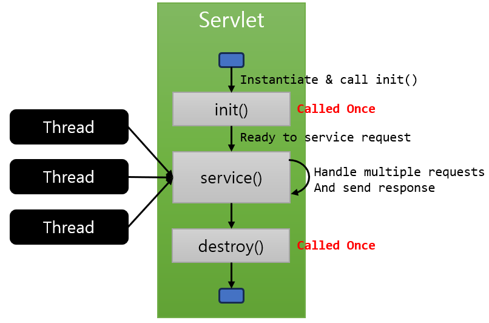

= Servlet 생명주기

1. 클라이언트의 요청이 들어오면 응답 대상 Servlet이 메모리에 있는지 확인
* 발견되지 않으면 Servlet 객체를 생성하고 `init()` 메소드 호출
2. `Service()` 메소드를 실행하여 응답 을 생성하고 전송
3. `destroy()` 메소드를 실행하여 객체 제거

---

Servlet 생명주기는 아래와 같습니다.

1. 클라이언트의 요청이 들어오면 WAS는 해당 요청에 맞는 Servlet이 메모리에 있는지 확인하고, 없으면 해당 Servlet 객체를 생성한 후 init 메서드를 실행합니다.
2. Servlet의 Service() 메소드를 실행하여 요청에 맞는 응답을 생성하고 전송합니다.
3. WAS가 재시작하거나 종료할 때 destroy() 메소드를 호출하여 객체를 제거합니다.

== init() 메소드
* Servlet 객체를 초기화하는 역할을 수행하여, 한 번만 수행됩니다.
- 클라이언트의 요청에 따라 적절한 Servlet이 생성되고 이 Servlet이 메모리에 로드될 때 init() 메서드가 호출됩니다.

== service(request, response) 메소드
* 응답에 대한 모든 내용이 구현되며, Servlet이 수신한 모든 request에 대해 service() 메서드가 호출됩니다.
* HttpServlet의 Subclass인 Servlet 클래스에서 service() 메서드를 오버라이드 하지 않았다면, HttpServlet의 service()가 호출됩니다.
* service() 메서드는 request의 type(HTTP Method : GET, POST, PUT, DELETE 등)에 따라 적절한 메서드(doGet, doPost, doPut, doDelete 등)를 호출합니다. service() 메소드는 다형적으로 동작합니다.
* 메서드가 return 하면 해당 thread는 제거됨

== destory() 메소드
* 한 번만 수행되며, Servlet 객체를 메모리에서 제거합니다.
* Web Application이 갱신되거나 WAS가 종료될 때 호출됩니다.

