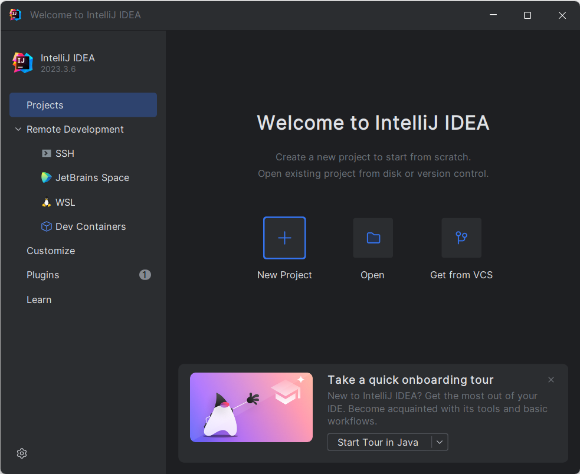
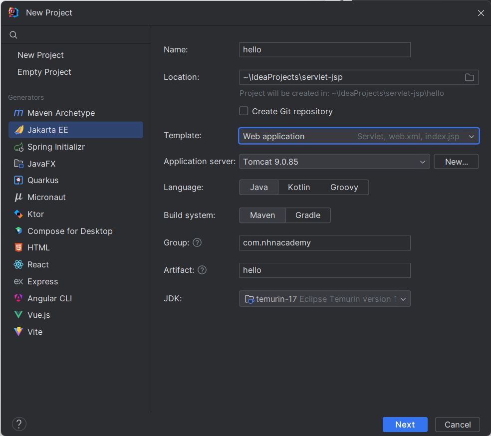
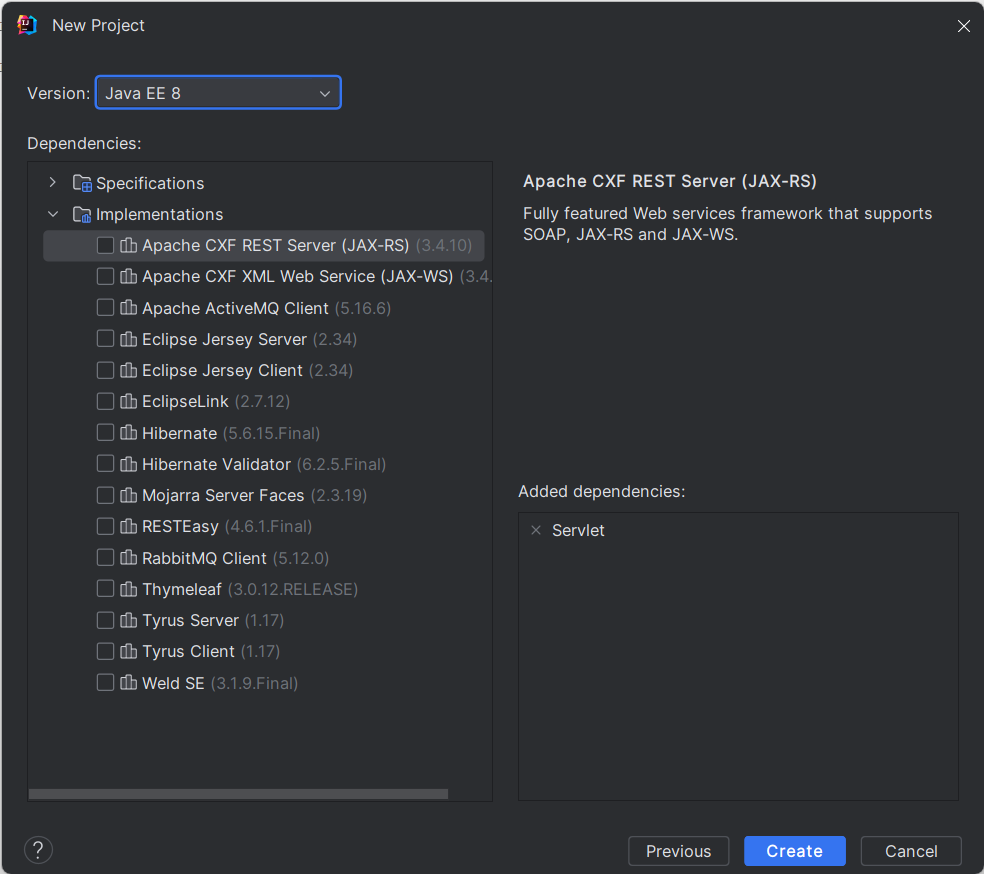

= 연습 4-1 간단한 Servlet 애플리케이션 생성

이 연습에서는 HelloServlet 문자열을 출력하는 간단한 Servlet 애플리케이션을 작성합니다. 아래 절차에 따릅니다. 

1. IntelliJ를 실행합니다.
2. New Project를 클릭합니다.
+

+
3. New Project 대화상자에서 아래와 같이 설정한 후 **Next** 버튼을 클릭합니다.
a. **Name**: hello
b. **location**: ~\IdeaProjects/servlet-jsp
c. **Template**: Web application
d. **Application Server**: 설치된 Tomcat 디렉토리
. Windows: c:\apache-tomcat-9.8.xx
. macOS: /opt/homebrew/Cellar/tomcat@9/9.0.85/
. Linux(Ubuntu): /var/lib/tomcat9/
e. **Language**: Java
f. **Build System**: Maven
g. **Group ID**: com.nhnacademy
h. **ArtifaIdt**: hello
i. JDK: 설치된 JDK 버전과 맞는지 확인
+

+
4. 다음 페이지에서 **Version**에 Java EE 8을 선택하고 **Create** 버튼을 클릭합니다.
+

+

