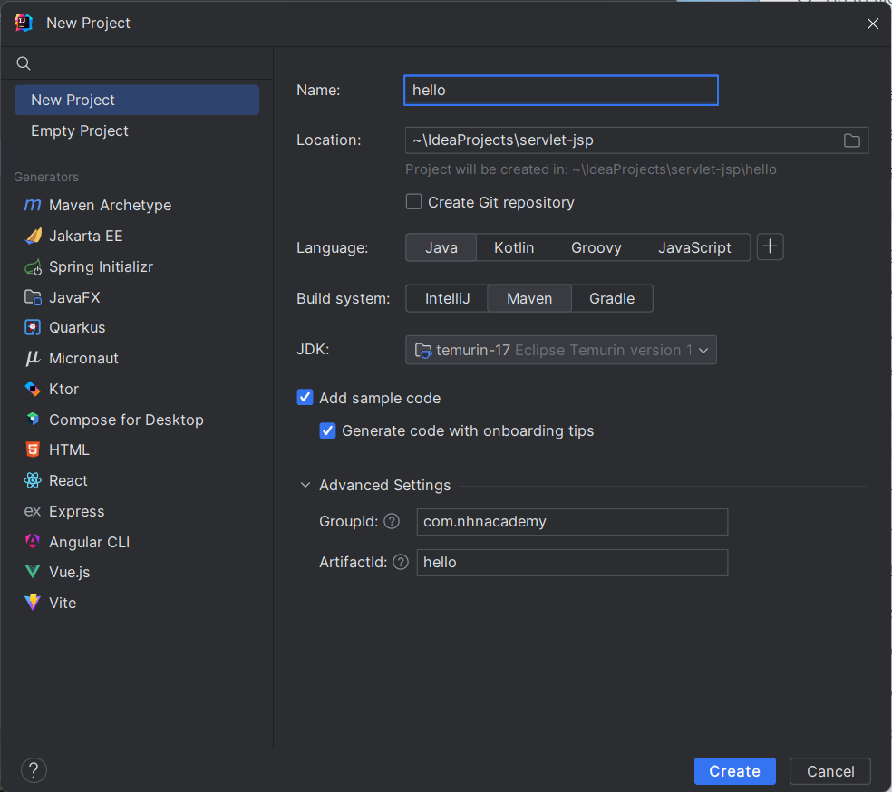
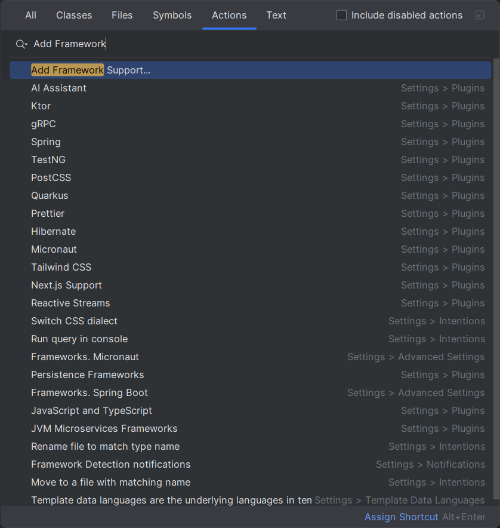
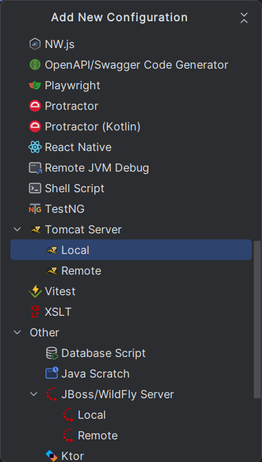
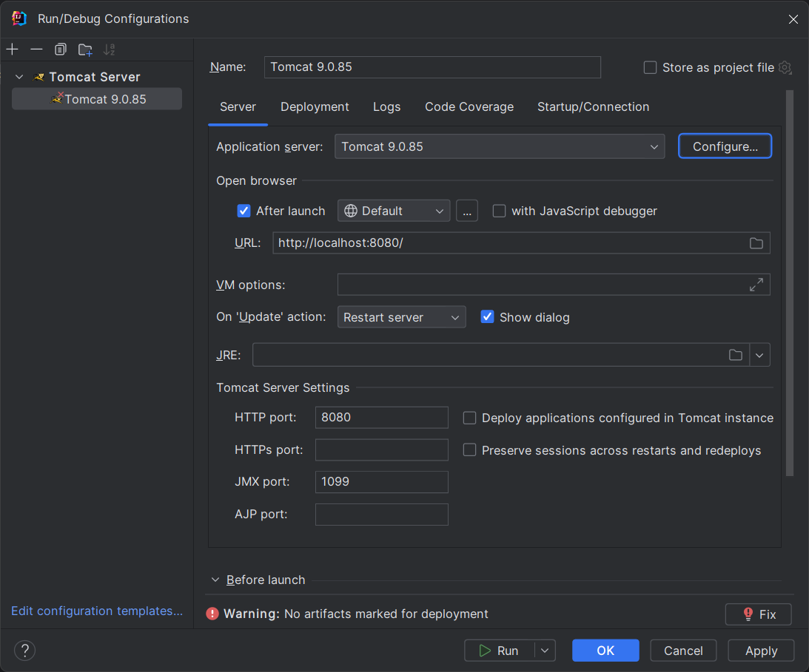
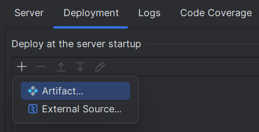

= 연습 4-1 간단한 Servlet 애플리케이션 생성

이 연습에서는 HelloServlet 문자열을 출력하는 간단한 Servlet 애플리케이션을 작성합니다. 아래 절차에 따릅니다. 

1. IntelliJ를 실행합니다.
2. New Project를 클릭합니다.
+

+
3. New Project 대화상자에서 아래와 같이 설정한 후 **Create** 버튼을 클릭합니다.
* **Name**: hello
* **Location**: ~/ideaProject/servlet-jsp
* **Language**: Java
* **Build system**: Maven
* **JDK**: <설치된 JDK 버전과 맞는지 확인>
* **GroupId**: com.nhnacademy
* **ArtifactId**: hello
+

+
4. 프로젝트가 생성되면, Project 창에서 hello 프로젝트를 선택한 후 Ctrl + Shift + A 키를 누릅니다.
+
5. **Add Framework Support**를 검색하고 클릭합니다.
+

+
6. **Add Framework Support** 창에서, **Java EE** 아래의 **Web Application**을 선택하고 **Version**을 4.0으로 선택한 후 **OK** 버튼을 클릭합니다.
+

+
7. 생성된 프로젝트에서, web 폴더를 마우스 오른쪽 클릭하고 Refactor -> Rename을 클릭한 후 폴더의 이름을 webapps로 변경합니다.
8. webapps 폴더를 src/main 폴더로 이동합니다.
9. 프로젝트 폴더 구조를 확인합니다.
+

+
10. pom.xml 파일을 엽니다.
11. pom.xml 파일에, jakarta.servlet-api 의존성을 추가합니다.
+
[source, xml]
----
<dependencies>
    <dependency>
        <groupId>jakarta.servlet</groupId>
        <artifactId>jakarta.servlet-api</artifactId>
        <version>4.0.4</version>
        <scope>provided</scope>
    </dependency>
</dependencies>
----
+
12. 빌드 플러그인인 maven-war-plugin 설정을 추가합니다.
+
[source, xml]
----
<packaging>war</packaging>

<build>
    <plugins>
        <plugin>
            <groupId>org.apache.maven.plugins</groupId>
            <artifactId>maven-war-plugin</artifactId>
            <version>3.3.2</version>
            <configuration>
                <warSourceDirectory>src/main/webapp</warSourceDirectory>
                <failOnMissingWebXml>false</failOnMissingWebXml>
            </configuration>
        </plugin>
    </plugins>
</build>
----
+
13. 전체 pom.xml 파일은 아래와 같이 됩니다.
+
[source, xml]
----
<?xml version="1.0" encoding="UTF-8"?>
<project xmlns="http://maven.apache.org/POM/4.0.0"
         xmlns:xsi="http://www.w3.org/2001/XMLSchema-instance"
         xsi:schemaLocation="http://maven.apache.org/POM/4.0.0 http://maven.apache.org/xsd/maven-4.0.0.xsd">
    <modelVersion>4.0.0</modelVersion>

    <groupId>com.nhnacademy</groupId>
    <artifactId>hello</artifactId>
    <version>1.0-SNAPSHOT</version>

    <properties>
        <maven.compiler.source>17</maven.compiler.source>
        <maven.compiler.target>17</maven.compiler.target>
        <project.build.sourceEncoding>UTF-8</project.build.sourceEncoding>
    </properties>

    <dependencies>
        <dependency>
            <groupId>jakarta.servlet</groupId>
            <artifactId>jakarta.servlet-api</artifactId>
            <version>4.0.4</version>
            <scope>provided</scope>
        </dependency>
    </dependencies>

    <packaging>war</packaging>
    
    <build>
        <plugins>
            <plugin>
                <groupId>org.apache.maven.plugins</groupId>
                <artifactId>maven-war-plugin</artifactId>
                <version>3.3.2</version>
                <configuration>
                    <warSourceDirectory>src/main/webapp</warSourceDirectory>
                    <failOnMissingWebXml>false</failOnMissingWebXml>
                </configuration>
            </plugin>
        </plugins>
    </build>
</project>
----
+
14. hello/src/main/java/com.nhnacademy 폴더를 마우스 오른쪽 클릭하고 **New** -> **Package**를 클릭합니다.
+

+
15. **New Package** 대화상자에서 com.nhnacademy.hello를 입력하고 Enter 키를 눌러 패키지를 생성합니다.
+

+
16. 생성한 com.nhnacademy.hello 패키지를 마우스 오른쪽 클릭하고 **New** -> **Java Class**를 클릭합니다.
+

+
17. **Class**를 선택하고 **Name**에 HelloServlet을 입력하고 Enter 키를 눌러 클래스를 생성합니다.
+

+
18. 생성된 HelloServlet 클래스를 HttpServlet 클래스에서 파생되도록 코드를 수정합니다.
19. HelloServlet 클래스에 아래와 같이 doGet 메소드를 오버라이드하는 메소드를 작성합니다.
+
[source, java]
----
protected void doGet(HttpServletRequest req, HttpServletResponse resp) {
    resp.setCharacterEncoding("UTF-8");
    try(PrintWriter writer = resp.getWriter()) {
        writer.println("<!DOCTYPE html>");
        writer.println("<html>");
        writer.println("<head>");
        writer.println("<meta charset='utf-8'>");
        writer.println("</head>");
        writer.println("<body>");
        writer.println("<h1>hello servlet!</h1>");
        writer.println("<h1>안녕 서블릿!</h1>");
        writer.println("</body>");
        writer.println("</html>");
    } catch (IOException e) {
        throw new RuntimeException(e);
    }
}
----
+
20. webapps/web.xml 파일을 엽니다.
21. servlet과 servlet-mapping 요소를 추가하여 추가한 HelloServlet 클래스를 등록합니다.
+
[source, xml]
----
<servlet>
    <servlet-name>helloServlet</servlet-name>
    <servlet-class>com.nhnacademy.hello.HelloServlet</servlet-class>
</servlet>
<servlet-mapping>
    <servlet-name>helloServlet</servlet-name>
    <url-pattern>/hello</url-pattern>
</servlet-mapping>
----
+
22. **Run** 메뉴에서 **Edit Configuration..**을 클릭합니다.
+

+
23. **Run/Debug Configuration** 창에서 **Add new run configuration...**을 클릭합니다.
+

+
24. **Add new Configuration** 대화상자에서 **Tomcat Server** -> **Local**을 선택합니다.
+

+
25. Tomcat Server 설정 창에서, **Server** 탭의 **Application Server** 에서 **Configur..** 버튼을 클릭합니다.
26. **Application Servers** 창에서, **Tomcat Home**에 Tomcat이 설치된 디렉토리를 지정합니다.
. Windows: c:\apache-tomcat-9.8.xx
. macOS: /opt/homebrew/Cellar/tomcat@9/9.0.85/
. Linux(Ubuntu): /var/lib/tomcat9/
+

e. **Language**: Java
+
27. Tomcat 설정을 확인합니다.
+

+
28. **Deployment** 탭에서, **Deploy at the servet startup** 구역에서 + 기호를 클릭하고 **Artifact..**를 클릭합니다.
+

+
29. **Select Artifacts to Deploy** 대화상자에서 **hello:war exploded**를 선택하고 **OK** 버튼을 클릭합니다.
+

+
30. **Application context**를 `/` 로 변경합니다.
+

+
31. **Run/Debug Congigurations** 창에서 **OK** 버튼을 클릭합니다.
32. 오른쪽 위에서 Run 버튼을 클릭합니다.
+

+
33. 